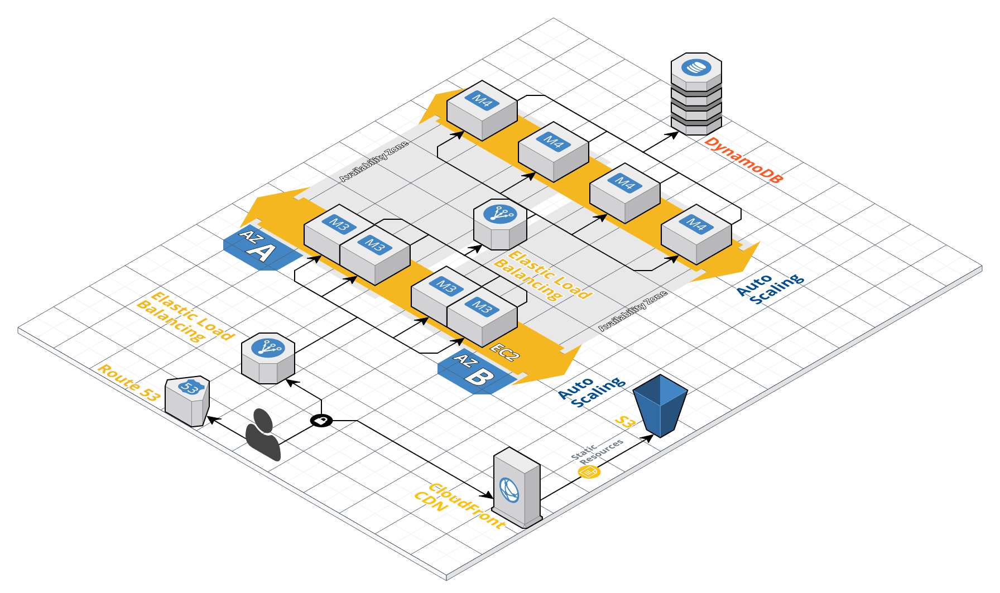
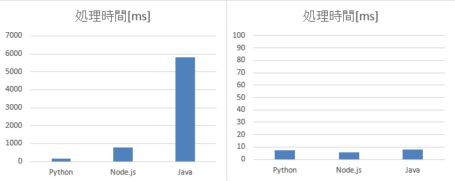
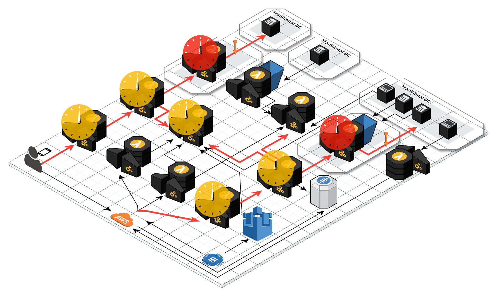
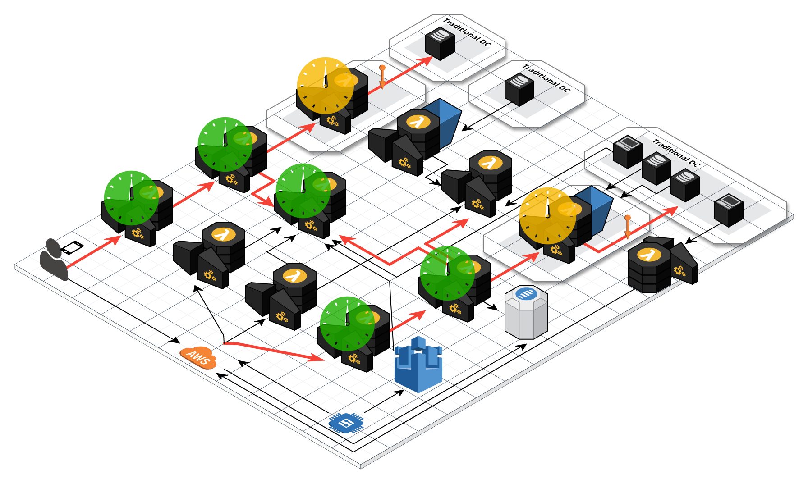

name: Java から TypeScript へ 切り替えて 加速するサーバーレス開発
count: false
class: cover, center, middle
# Java から TypeScript へ 切り替えて
# 加速するサーバーレス開発
.event-logo[]
.english[
  Serverless development to accelerate by switching from Java to TypeScript
]
.footer[[@JJUG CCC 2018 Spring](http://www.java-users.jp/ccc2018spring/) / 45 min]

---
count: false
class: preface, agenda
### Agenda
1. Java から TypeScript へ 移行した背景
2. TypeScript - AWS Lambda の 導入
3. Java と TypeScript の 親和性
4. AWS Lambda 実行環境 を 移行した結果
5. まとめ

---
class: center, middle
## About us
---
layout: false
### lulzneko
.ui.grid[
.eleven.wide.column[
  手段のためには目的を選ばず、新しい技術を見つけては試すことが生きがいの、IT好きで葉巻好き酒好きなだけの猫。

  Java で アプリ開発すること十数年。Java Applet や Servlet などでアプリを作ってきて、現在は AWS Lambda を 使った サーバーレス な アプリ開発に夢中。

  開発言語 は Java が よいと思っているが、Lambda での起動遅延の問題から、TypeScript での開発と二足の草鞋ならぬ靴下を履く。

  **Java 大好きです！**
]
.four.wide.column[
  .resize-w240[]  
  .resize-w240[]  
  .social[.fa[.fa-github[]] [@lulzneko](https://github.com/lulzneko)]  
  .social[.fa[.fa-twitter[]] [@lulzneko](https://twitter.com/lulzneko)]  
]
]

.footnote[
  ※ 発言や投稿は私的なものであり、所属する企業や組織とは関係ありません。  
  　 また Riotz.works は 開発チームの名称です。  
]

---
class: center, middle
## Java から TypeScript へ 移行した背景
---
### 本セッションで使う用語と概要
用語や定義については諸説ありますが、本セッションでは下記概要を前提としてお話します。
- **サーバーレス**  
物理/仮想サーバー や コンテナの実行環境 などを管理しない形態のアプリや開発  
今回は OS と 実行環境(e.g. JavaVM や Tomcat) を クラウドに任せているもの (乱暴だけど)  

- **AWS Lambda と Amazon DynamoDB**  
AWS で 提供される サーバーレスな アプリ実行環境 と Key/Value型DB の サービス

- **Node.js / JavaScript**  
ブラウザ上ではなく OS 上で JavaScript 言語で作ったアプリが実行できる環境  
※ 本セッションでは JavaScript/ECMAScript は JavaScript の 呼称に統一します  

- **TypeScript**  
JavaScript 言語 に 型の定義を導入したスーパーセットの開発言語  

---
### 最初のシステム と 開発チーム
.cloudcraft[
.text[
#### 最初のシステム
- コンシューマー向けの Web アプリケーション
- Java で Spring Boot を 利用
- Amazon EC2 ＋ Amazon DynamoDB の 半サーバーレスな環境

#### 開発チーム
- Java 歴20年 を 筆頭に、全員 Java の 開発者 で 数名
- Web の フロント開発経験 エンジニア １名
- DevOps 体制

**サーバーレスな Key/Value Store を 使うが**  
**よくある Java の アプリケーション**
]

]

---
### AWS Lambda へ アーキテクチャ変更
.cloudcraft[
.text[
#### 2014年、AWS Lambda 登場
- DynamoDB のように マネージドで運用できる！
- インスタンス稼働時間ではなく処理時間に対しての課金！
- 使うしかない！！

#### アーキテクチャ変更
- Lambda の Java ランタイム が ローンチされるのを待って、移行開始
- フレームワークの変更や抽象化層の変更などを行うが、基本そのまま

**簡易フレームワークを実装し Spring Boot は やめる**  
**サーバーレス化できたため、OS や 実行環境 の メンテ不要に**
]

]

---
### エンハンス、そして "問題" へ
.cloudcraft[
.text[
#### エンハンス
- 既存システムと連携する IoT の プラットフォームとしての要件
- マイクロ・サービス型のアーキテクチャとして機能を追加
- Java チーム なので、**自然と Java で 追加開発**
- **15** 近い マイクロ・システムを構築...

#### 不安要素
- 既存システム連携に 固定IP 必須
- マイクロ化が過剰で複雑になった

#### そして... ~~伝説へ~~
]

]

---
### 問題 と 原因
.cloudcraft[
.text[
#### 問題
- タイムアウトが多発、サービスとして公開は厳しい 😭

#### 原因
- １シーケンスのチェーンが長い（最大 6 と 5 がある）
- VPC Lambda での遅延がある
- コールドスタートの発生個所が多くなる

#### つまり
- **分割しすぎ、パス長すぎ！**
- **コールドスタート、甘く見すぎ！**
]

]

---
### コールドスタート？ 何が起こるの？？
#### AWS Lambda の コンテナの動き
- AWS Lambda は トリガを受けて処理をするが、利用できるコンテナがない場合は新規に起動する
- 起動したコンテナは再利用されるが、ある程度の時間使われないと破棄される
- 完全にアクセスがなく全く新規の場合と、スケールして新規にコンテナを起動する場合がある

#### コールドスタート
- コンテナが再利用されず、新規のコンテナが割り当てられた状態で起動すること

#### 問題
- ネットワーク、コンテナ、アプリのロード、ランタイムの起動... 処理開始まで時間がかかる

.footnote[
  **参考文献**  
  　 全部教えます！サーバレスアプリのアンチパターンとチューニング - Taste of Tech Topics  
  　 [`https://d0.awsstatic.com/events/jp/2017/summit/devday/D4T7-2.pdf`](https://d0.awsstatic.com/events/jp/2017/summit/devday/D4T7-2.pdf), (参照 2018.5.22)
]

---
### AWS Lambda の 実行ランタイムの違い と 変更
.ui.grid[
.eight.wide.column[
#### 実行ランタイムの種類
- C#,　Go, Java,　Node.js,　Python

#### スクリプト系ランタイム は 速い！？
- スクリプト系ランタイム は Node.js と Python
- Java に 近い構文は Node.js = JavaScript だった
- JavaScript なら、何かと小さなものを作ることも

**Node.js = JavaScript への移行を決断**  
**(しかし、この選択は後に苦労の種ともなる...)**
]
.seven.wide.column[
.small[
AWS Lambda の 処理時間比較
.resize-h[]

AWS Lambda で 高CPU負荷時の処理時間比較
.resize-h[]
]
]
]

.footnote[
  **参考文献**  
  　 AWS Lambdaの処理性能を言語毎に測ってみた - Taste of Tech Topics  
  　 [`http://acro-engineer.hatenablog.com/entry/2016/08/02/120000`](http://acro-engineer.hatenablog.com/entry/2016/08/02/120000), (参照 2018.5.22)
]

---
class: center, middle
## TypeScript - AWS Lambda の 導入
---
### AWS Lambda の Node.js 最適、でも JavaScript は ちょっと...
#### JavaScript 言語 の イメージ
- 型がない、クラスもない、柔っこい
- 自動型変換があって文字列と数値が混ざると危険
- スクリプトでツラツラ書くので処理の流れががわかりにくく、メンテできない

#### Node.js の イメージ
- 最近のサーバーサイドやアプリ開発で人気があり興味津々
- ライブラリが豊富だが Java のような定番がない
- テストの仕方、CI 連携の仕方など、アプリ開発周辺で色々わからない

#### 注意
- **個人の感想です。必ずしも正しくなく誤解も多々している部分があります。**
- Web フロントエンドの手伝い や Slack Bot 実装で使ったことがあるレベルでの感想です。

---
### TypeScript！！
#### TypeScript とは
- JavaScript の スーパーセットで、JavaScript に対して機能拡張をした言語
- JavaScript を そのままで利用でき、既存の豊富なライブラリも利用できる
- **静的な型付けができる** ほか、JavaScript の 最新仕様が先行利用できる

#### メリット
- 静的な型付けができることで保守性が向上しチーム開発が行いやすくなる
- モダンな言語機能が利用できる (null安全、型注釈、型推論、列挙型、ジェネリクス、etc...)
- JavaScript や Node.js の エコ・システムに乗れる (npm、webpack、etc...)

#### デメリット
- 既存 JavaScript ライブラリ に TypeScript の 型定義がない場合に困る (後付け追加できるが)
- アプリ内に JavaScript と TypeScript 混在すると厳しい
- ~~なぜか気持ちが JavaScript モードになって自由なスクリプトっぽく書きたくなる (たぶん私だけ...)~~

---
### TypeScript の 実績
#### 開発体制
TypeScript が マイクロソフト社が開発しオープンソースでメンテナンスされています。
- 公式サイト: [http://www.typescriptlang.org/](http://www.typescriptlang.org/)
- GitHub: [https://github.com/Microsoft/TypeScript](https://github.com/Microsoft/TypeScript)

#### 利用事例
- Google社 の 標準言語として採用
- Google社開発 の AngularJS ([https://angularjs.org/](https://angularjs.org/))
- Microsoft社開発 の Visual Studio Code ([https://code.visualstudio.com/](https://code.visualstudio.com/))
- 170+ Friends of TypeScript ([https://www.typescriptlang.org/community/friends.html](https://www.typescriptlang.org/community/friends.html))

---
class: center, middle
## Java と TypeScript の 親和性
---
### Java と TypeScript の 実装例
標準出力に Hello World ! する、Java に そっくりな TypeScript 実装。
- クラスの公開は `export` の有無で、メンバー変数やメソッドのアクセスレベルは Java と 同じ
- 型を後に書く (e.g. 引数 `String[] args` が `args: String[]`、メソッド戻り値が `: void` と 後)
- Java の mainメソッド に あたるものは無いので任意のメソッド名でよく、自分で実行する

.ui.grid[
.seven.wide.column[
<pre class="prettyprint"><code class="language-java">
public class GreetingJava {

    public static void main(String[] args) {
        System.out.println("Hello World !");
    }
}
</code></pre>
]
.seven.wide.column[
<pre class="prettyprint"><code class="language-typescript">
export class GreetingTypeScript {

  public static main(args: String[]): void {
    console.log('Hello World !');
  }
}

GreetingTypeScript.main(undefined);
</code></pre>
]
]

---
### JavaScript 特有の非同期コールバック型処理は要注意！
JavaScript は ブラウザ上で動作し、描画などの処理を止めないようにする必要があった  
そのために時間がかかる処理は非同期のコールバック型になっていることが多い  
下記実装例は Java と TypeScript/JavaScript で 処理順が異なり、引数文字列の番号が実際の処理順  
(実装例は sleep の 無理やり例ですが HTTP リクエスト や ファイル I/O などでよく引っかかる)  

.ui.grid[
.seven.wide.column[
<pre class="prettyprint"><code class="language-java">
public class GreetingJava {

    public static void main(String[] args) throws InterruptedException {
        System.out.println("1. Sleep a bit...");
        Thread.sleep(5000);
        System.out.println("2. Wake up from sleep");

        System.out.println("3. Hello World !");
    }
}
</code></pre>
]
.seven.wide.column[
<pre class="prettyprint"><code class="language-typescript">
export class GreetingTypeScript {

  public static main(args: String[]): void {
    console.log('1. Sleep a bit...');
    setTimeout(() => {
      console.log('3. Wake up from sleep');
    }, 5000);

    console.log('2. Hello World !');
  }
}

GreetingTypeScript.main(undefined);
</code></pre>
]
]

---
### 非同期コールバック型処理 は async-await で
JavaScript の 非同期コールバック型処理は TypeScript でも根本からは変わらない  
乱暴ですが Java の Lambda式で常に `.parallel()` の後に処理が続いているとイメージ  
ただし、非同期のコールバック型だけだと実装がつらいので async-await を 使う

.ui.grid[
.seven.wide.column[
<pre class="prettyprint"><code class="language-typescript">
export class GreetingTypeScript {

  public static main(args: String[]): void {
    console.log('1. Sleep a bit...');
    setTimeout(() => {
      console.log('3. Wake up from sleep');
    }, 5000);

    console.log('2. Hello World !');
  }
}

Greeting.main(undefined);
</code></pre>
]
.seven.wide.column[
<pre class="prettyprint"><code class="language-typescript">
export class GreetingTypeScriptAsyncAwait {

  public static async main(args: String[]): Promise<void> {
    console.log('1. Sleep a bit...');
    await new Promise(resolve => setTimeout(resolve, 5000));
    console.log('2. Wake up from sleep');

    console.log('3. Hello World !');
  }
}

Greeting.main(undefined);
</code></pre>
]
]

---
### Java と TypeScript の 親和性
#### 相性が良さそうなところ
- 静的な型付けが入ることで、構文において ほぼ Java と 同じメリットが得られる
- クラスやインターフェイスを使った実装にすることで Java と 同じ構造にできる
- Java 開発で使われている IDE で対応しているものが多い (Eclipse, IntelliJ IDEA, NetBeans etc...)
- 非同期のコールバック型のトラップがあるが、Java Lambda式の `.parallel()` と 思えば大丈夫  
  async-await も 使えるので非同期のコールバック型も逐次実行にできる

#### まだ苦しそうなところ、ハマりどころ
- TypeScript の 進化が早く、ウェブ上には古い情報が散見される
- ライブラリが豊富すぎ、また名前も似ていて選択が大変
- 使いたいライブラリに TypeScript の 型定義がないと大変  
  ⇒ 型定義は自分で後付けできるので詰みはしないが型定義を作ったりメンテはやはり厳しい

---
class: center, middle
## AWS Lambda 実行環境 を 移行した結果

---
### Java - AWS Lambda の コールドスタート時レスポンスタイム
.cloudcraft[
.text[
.icon[
 __Lambda (Java) : 7s ~ 10s__ ↑  

 __VPC Lambda (Java) : 17s ~ 20s__ ↑
]

呼び出しチェーンの中で 1回でも  
新しい Lambda コンテナの起動に当たったら  
（特にVPC Lambda）
ほぼタイムアウト　
]

]

---
### TypeScript 移行後 の コールドスタート時レスポンスタイム
.cloudcraft[
.text[
.icon[
 __Lambda (Node.js) : 2s ~ 3s__ ↑  

 __VPC Lambda (Node.js) : 10s ~ 13s__ ↑
]

VPC Lambda の場合、ある程度  
時間がかかってしまうのは仕方ないが、  
API Gateway のタイムアウトには  
何とか持ちこたえることができる
]

]

---
class: center, middle
## まとめ
---
class: wrapup
### まとめ
- **Java 開発者にとって TypeScript の 親和性は高い**
- TypeScript は AWS Lambda 開発で良い選択肢になりうる 
- 環境や処理特性に合わせたアーキテクチャ選択と対応力が必要

.note[
#### Java VM と AWS Lambda の Java ランタイム への期待
- Java VM の 小型化 や 必要な機能に分離などができると嬉しい
- AWS Lambda の コールドスタートが発生しなくなったり、起動が早くなると嬉しい
]

.note[
#### 補足
- Java ランタイムは悪くない！ 複雑なアーキが悪い！！（反省してます）  
- 過剰マイクロ化だが、Traditional環境依存を分離できた（後悔はしていない）
]

---
count: false
class: bottom, center, backcover
## ご清聴いただき ありがとうございました。
.english[
  It’s been a pleasure being with all of you today, thank you.
]

.footer[Thank you for contacting [@lulzneko](https://twitter.com/lulzneko) by .fa[.fa-twitter[]]]

---
count: false
class: bottom, center, eof
## EOF

