name: 個人やサークルとして応募する CfP、あるいは その思い切り
count: false
class: cover, center, middle
# 個人やサークルとして応募する CfP、
# あるいは その思い切り
.event-logo[]
.english[
  CfP to apply as an individual or engineer club activities
]
.footer[[@CfPの書き方を学ぼう - 登壇の技術を勉強する会](https://engineers.connpass.com/event/154495/) / 10 min]

---
### CfP 応募 で 二の足を踏むことありませんか？
- 会社の都合などによって登壇することが厳しい...

- 社内の空気的に登壇するのがちょっと難しい...

- 業務内容なので公開することができない...

---
### CfP 応募 で 二の足を踏むことありませんか？
- 会社の都合などによって登壇することが厳しい...

- 社内の空気的に登壇するのがちょっと難しい...

- 業務内容なので公開することができない...

.arrow-left-center[.text-arrow-large[.fa[.fa-angle-double-down[]]]]

.bottom[.text-large-32[
いっそのこと、個人やサークルとして CfP に 応募、登壇してみては？

むしろ個人やサークルとして登壇することのメリットは大きいのです！
]]

---
### でも、個人やサークルじゃ選考に通らなくない？
.no-margin[
  .text-large-32[通ります！]
]
- フリーランスの方は、実質 個人名で登壇します
- 会社名だとしてもスタートアップで、まだ名が知れてないケースもあります
- なによも知りたいのは会社名ではなく内容、技術やナレッジであり だからこそ公募(=CfP)してる

.img-devsumi[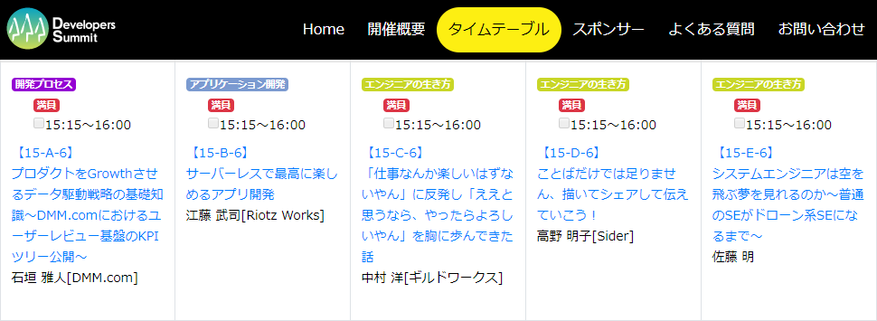]  

---
class: free
.ui.grid[
.eight.wide.column[
  .img-aboutus[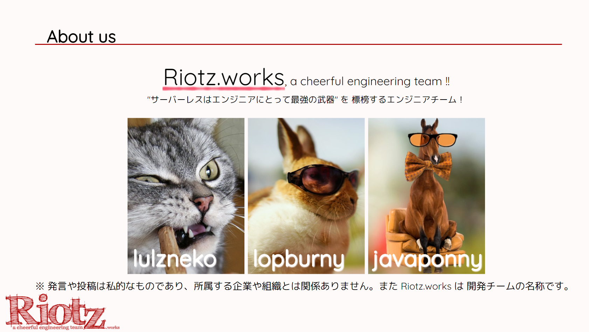]  
  .img-aboutus[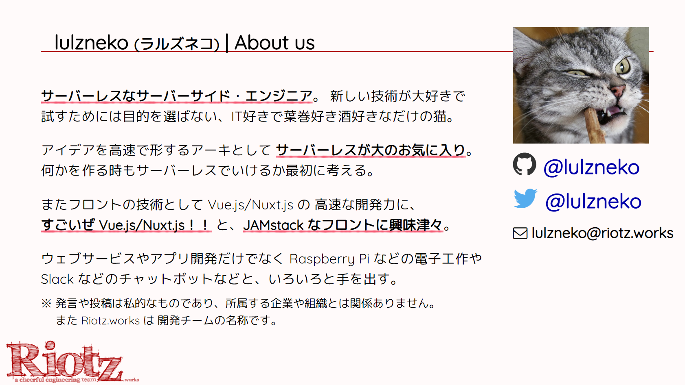]
]
.seven.wide.column[
### 自己紹介の口上
私たちは Riotz.works(ライオッツワークス) というチーム名で活動しています。

普段は会社員でシステムの開発などをしているのですが、このようなカンファレンスやイベントで IT 情報を発信したり、ハッカソンへ参加する際に Riotz.works を使っています。

なんか面白い動物園みたいなメンバーですが、今日は 私、この中の猫が来ています。

－－－－

lulzneo(ラルズネコ) という名前で活動しています。江藤と申します。

色々と書いてますがサーバーレスが好きです。

]
]]

---
class: free
.ui.grid[
.eight.wide.column[
  .img-aboutus[]  
  .img-aboutus[]
]
.seven.wide.column[
### おもなアクティビティ
.activities[
- **WordCamp Tokyo 2019**
- サーバーレス勉強会 [CLOSED]
- Vuetify Meetup #1
- **CloudNative Days Tokyo 2019**
- Serverless Meetup Tokyo #12
- SPAJAM 2019 東京A予選
- Shiftup! JP_Getshifter Vol3
- **JAWS DAYS 2019**
- **Developers Summit 2019**
- **東京 Node 学園祭 2018**
- Vue Fes Japan 2018 Reject Con
- **Serverlessconf Tokyo 2018**
- SPAJAM 2018 東京D予選
- **JJUG CCC 2018 Spring**
- Agile ＆ DevOps 勉強会 [CLOSED]
- **Serverlessconf Tokyo 2017**
]

.note-activities-url[
26イベント - 30本 応募 / 22採択
.url[https://riotz.works/#activities]
]
]]

---
### なぜ Riotz.works を必要としたのか
.no-margin[
あぁ、私は会社員...  
「上司さん、今度 XXX というイベントがあり、サーバーレスについて発表してみたいのですが 🙋‍♂️」  
- 「なぜ会社で出るの？」「何の意味があるの？」「そんなの上に説明できないけど？」の 嵐
- 「会社が推進してみたいになる」「誤解を招いたらどうする」「世間に何を言われるか」の 雨霰
- 「人前で話すなんてねー」「暇だよねー」「ドメイン取ってそｗ (⇐ 関係ない💢)」の ヒソヒソ...
.note-activities-url[
※ 当時の脚色付き再現で一部面白おかしく表現してます。また現在は所属が異なりこのようなことはありません。]]

.arrow-left-center[.text-arrow-medium[.fa[.fa-angle-double-down[]]]]

- IT系 や クラウドサービスを提供している会社でないと理解してもらうことが難しい
- 業務以外で活動することへの理解がまだまだ進んでいない (終業後の勉強会参加も似てる)

⇒ では、個人で応募しよ。コミケのサークル見たい感じ、最近は技術書典というのが流行ってるし！  
　 .small[(※ 初登壇 Serverlessconf Tokyo 2017 が 11/3、技術書店３ 10/22 開催、まさに盛り上がっていくのを目の前で見ているところだった)]  

---
### どうやって応募するのか
- CfP で 募集しているところにエントリーする
- 会社名 は 「なし」または「サークル名 .small[(e.g. ウチなら Riotz.works)]」を堂々と入力！
- できれば ドメイン取って、メールは使えるとよい .small[(Gmail アドレスだと通ったこともあるけどちょっと)]  
  .small[⇒ 独自ドメインでメールの送受信できるように、Google Domains のメール転送と Gmail の送信元を設定する | Articles | Rioz.works  
  　 https://riotz.works/articles/lulzneko/2019/03/03/google-domains-mail-forwarding-and-gmail-sender-settings/]

.img-1[
  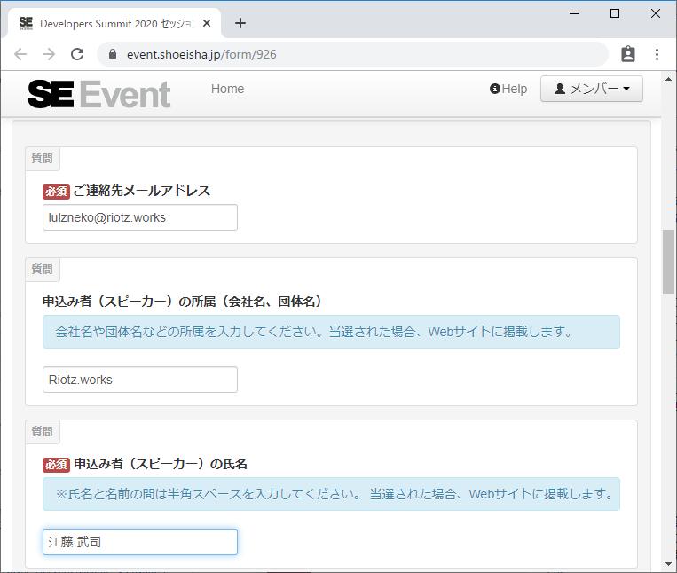
  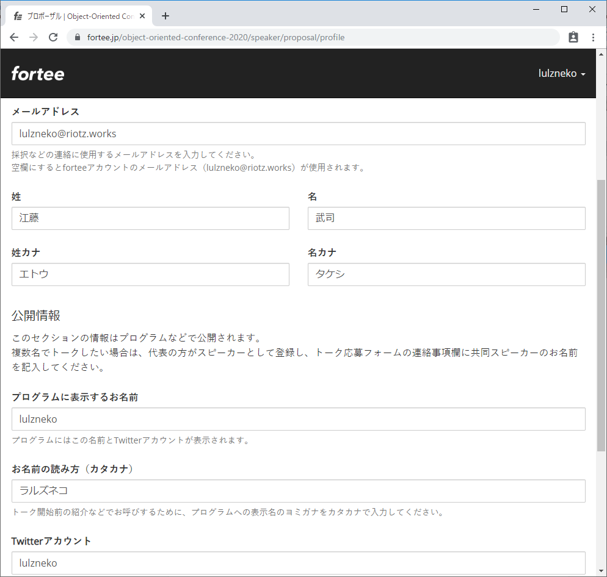
  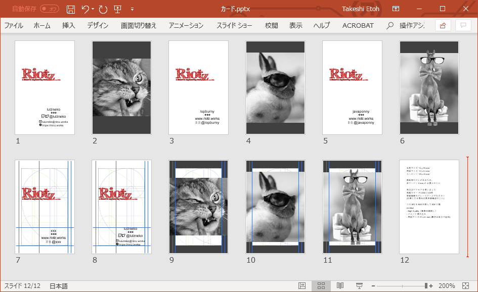
  .right[.small[※ 名刺は無くてもよいが、PowerPoint などで簡単に作れる。勉強会用名刺というのもあり。]]
]

---
### 何を話すのか
- 好きな技術、好きなサービス、ナレッジを、イベントの主旨や時流に合わせて ⇒ 今日の勉強会！
- 会社や業務内容、取り扱い注意情報などは確実に伏せて、汎化した内容にする
- 独自の勉強 ⇒ 発表 ⇒ 会社へ還元 の 流れが作れると素晴らしい！

.img-2[
  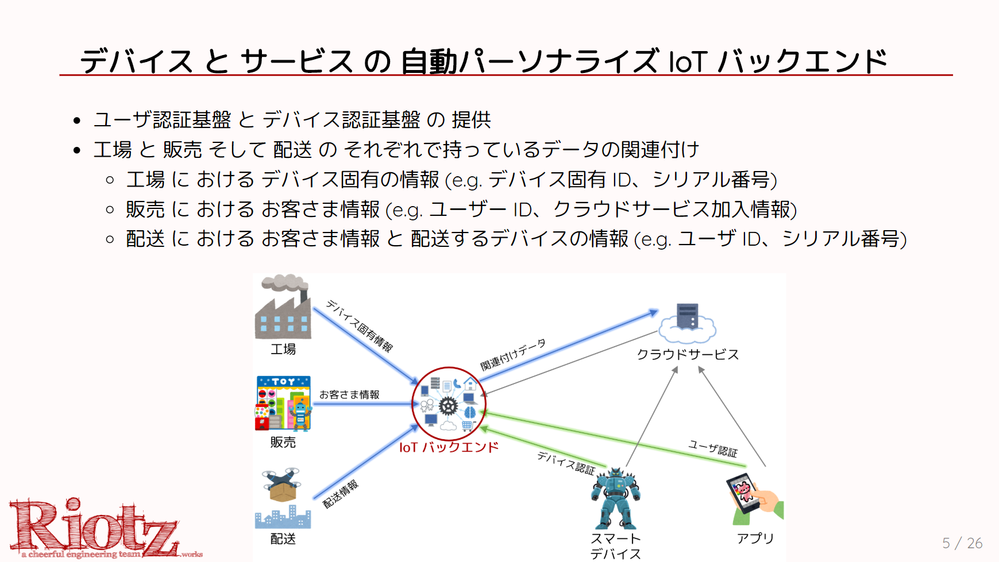
  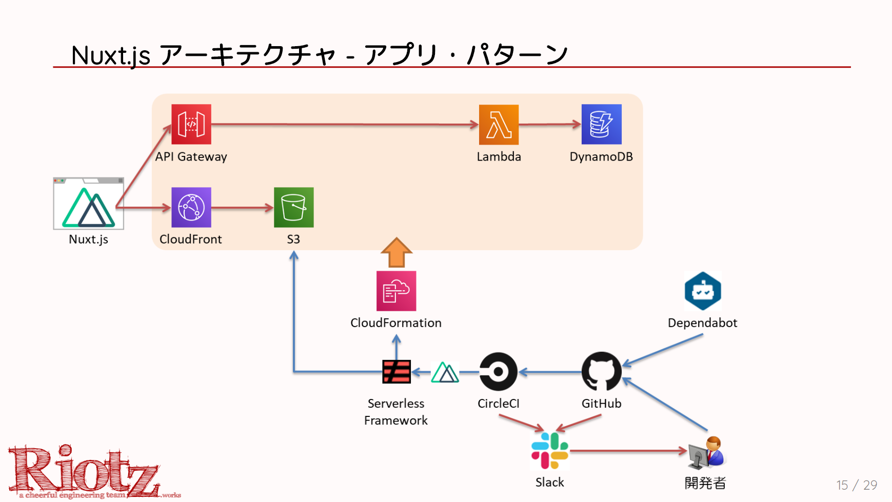
  .right[.small[※ 左は自社製品の汎化例、右は社内で使ってない技術を独自に勉強 JAWS Days などで発表後に社内で展開した例]]
]

---
### 個人やサークルで登壇することのメリット
- 登壇による認知などを個人として受けられる

- 好きなテーマでエントリーすることができる .small[(e.g. 業務のメインはサーバーレス、登壇の伝手から WordPress も)]

- 会社の宣伝や思惑などのスライドをなくせる .small[(宣伝したいのもあるけど、メインは技術やナレッジの話)]

.img-3[
  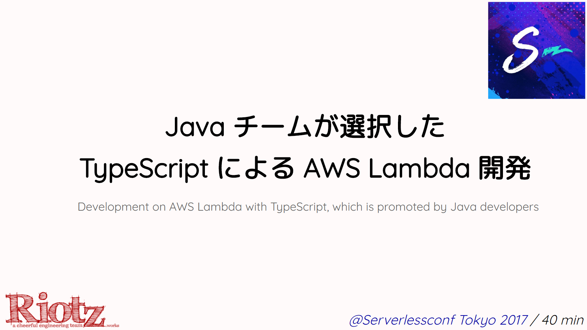
  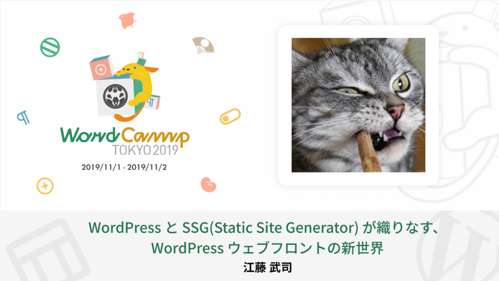
]

---
### 身バレは？
- いずれします

- 会社に関係ないような発表にしておくことが大事です (**身バレに関係なく汎化は重要！**)

- 何か言い訳ではないけど聞かれたら応えられるように e.g. 登壇は趣味です。

  　セッション、音楽をやってるようなもの、アカペラで技術について唄ってるの

  　ゴルフ行って仕事の話してるでしょ、そんな感じ

---
### 身バレは？
- いずれします

- 会社に関係ないような発表にしておくことが大事です (**身バレに関係なく汎化は重要！**)

- 何か言い訳ではないけど聞かれたら応えられるように e.g. 登壇は趣味です。

  　セッション、音楽をやってるようなもの、アカペラで技術について唄ってるの

  　ゴルフ行って仕事の話してるでしょ、そんな感じ

  　なんなら懇親会で、自分たちパリピー🎉⁉️  
  　⇒ だいたい みんな端っこで あまり話さない  
  　　 (私も そのタイプ、今日は話しましょう！)

.img-4[
  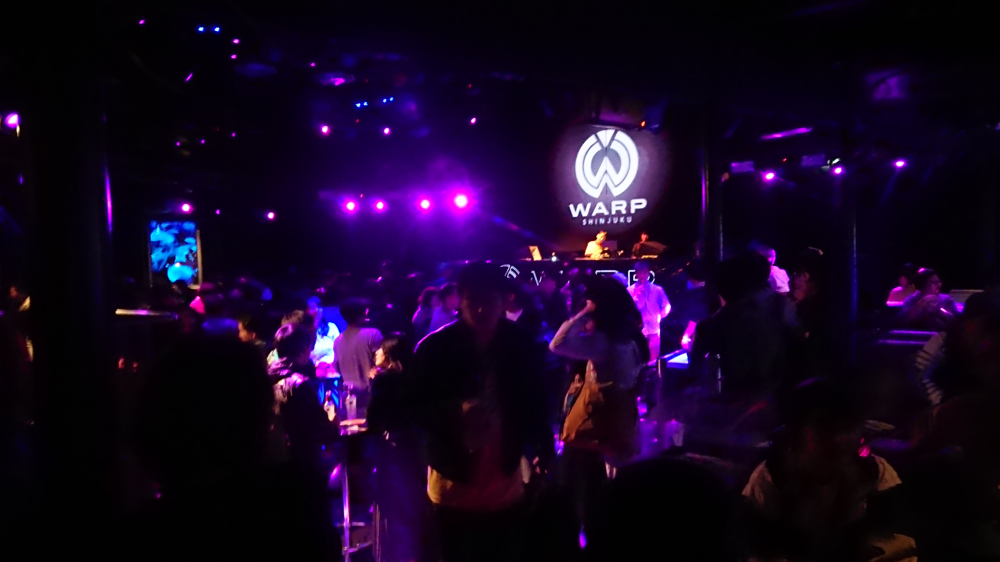  
  WordCamp Tokyo 2019 アフターパーティ
]

---
class: wrapup
### まとめ
- **CfP は 個人やサークルでエントリーすることができ、採択もされる**  

- **会社の業務やイメージから離れて好きな技術やサービスに打ち込める**  

- **技術者として会社に紐づかないブランディングと確固たる自信へ**  

.arrow-left-center[.text-arrow-large[.fa[.fa-angle-double-down[]]]]

.text-large-32[
多くの人が あなたの技術や知見を待っています！  
さぁ CfP に 応募して、カンファレンスで登壇しましょう！！  
]

---
count: false
class: bottom, center, backcover
## ご清聴いただき ありがとうございました。
.english[
  It's been a pleasure being with all of you today, thank you.
]

.footer[Thank you for contacting [@lulzneko](https://twitter.com/lulzneko) on .fa[.fa-twitter[]]]

---
count: false
class: bottom, center, eof
## EOF

