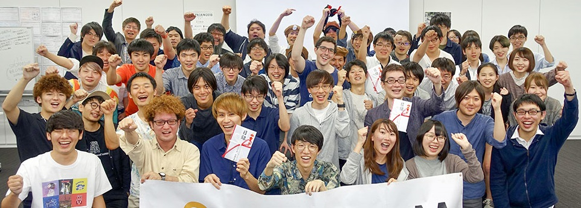
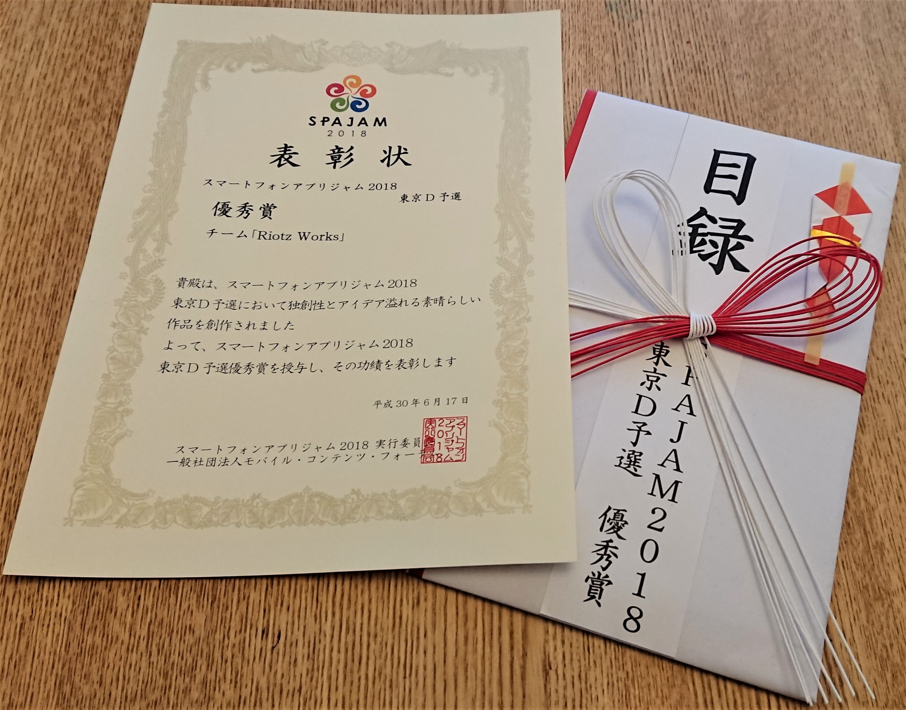
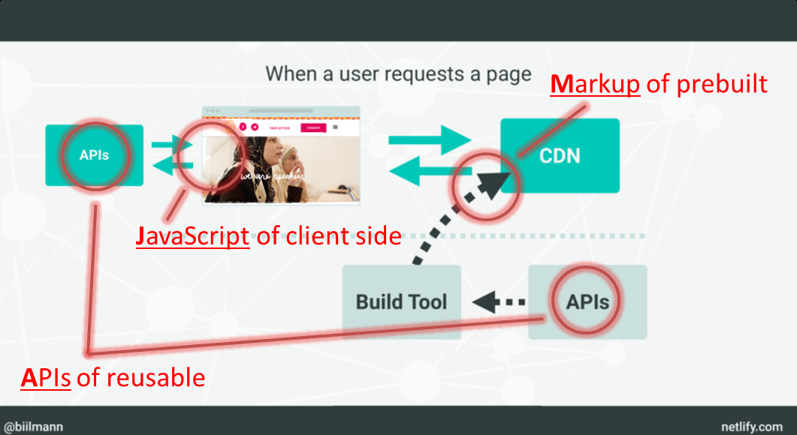

name: サーバレス・ネイティブ が お伝えする、フルサーバレス開発の魅力！
count: false
class: cover, center, middle
# サーバレス・ネイティブ が お伝えする
# フルサーバレス開発の魅力！
.event-logo[]
.english[
  Serverless Native delivers the attraction of full serverless development !
]
.footer[[@CloudNative Days Tokyo 2019](https://cloudnativedays.jp/cndt2019/) / 40 min]

---
count: false
class: preface, agenda
### Agenda
1. アイデアを即、形にできる 魅力 .english[
  To realize ideas as an application immediately
]
2. アプリの開発に専念できる 魅力 .english[
  To focus on developing applications
]
3. ピタゴラ装置を組み立てる 魅力 .english[
  To assemble Pythagorean Devices .small[(like the Rube Goldberg machine)]
]
4. JAMstack な サイト管理の 魅力 .english[
  To manage a site with JAMstack
]
5. まとめ .english[
  Wrap-up
]

---
class: center, middle
## About us
---
layout: false
### About us
.center[
  .text-large-48[.marker[Riotz.works]], a cheerful engineering team !!

  .resize-h320-box[.resize-w240-h320[] .img-text[lulzneko]]
  .resize-h320-box[.resize-w240-h320[] .img-text[lopburny]]
  .resize-h320-box[.resize-w240-h320[] .img-text[javaponny]]
]
.footnote[※ 発言や投稿は私的なものであり、所属する企業や組織とは関係ありません。また Riotz.works は 開発チームの名称です。  ]

---
layout: false
### lulzneko .small[(ラルズネコ)] | About us
.ui.grid[
.eleven.wide.column[
  新しい技術を見つけては試すことが大好きで技術を試すためには  
  目的を選ばない、IT好きで葉巻好き酒好きなだけの猫。

  アイデアを高速で形するアーキとして .marker[**サーバーレスが大のお気に入り**]。何かを作る時もサーバーレスでいけるかを最初に考える。

  Vue.js/Nuxt.js は 高速にフロントエンドの開発ができ、  
  .marker[**すごいぜ！ Vue.js/Nuxt.js！！** と 心酔]してる。

  ウェブサービスやアプリ開発だけでなく Raspberry Pi などの電子工作や Slack などのチャットボットなどと、いろいろと手を出す。
]
.four.wide.column[
  .resize-w240[]  
  .social[.fa[.fa-github[]] [@lulzneko](https://github.com/lulzneko)]  
  .social[.fa[.fa-twitter[]] [@lulzneko](https://twitter.com/lulzneko)]  
  .mail[.fa[.fa-envelope-o[]] lulzneko&#x40;riotz.works]  
]

.footnote[
  ※ 発言や投稿は私的なものであり、所属する企業や組織とは関係ありません。  
  　 また Riotz.works は 開発チームの名称です。  
]]

---
class: center, middle
## アイデアを即、形にできる 魅力 .english[
  To realize ideas as an application immediately
]
---
### サーバーレスは、開発を高速に行える
- インフラ環境はクラウドにお任せ

- インスタンスもコンテナーもクラウドにお任せ

- キャパシティも、スケーラビリティも、ログも、~~み～んな~~ クラウドにお任せ

.center[.text-arrow-large[.fa[.fa-angle-double-down[]]]]

.text-large-32[
  ロジック実行 や データ管理 など 使う機能の定義 と コード だけに 集中可能  
  いきなりプロトタイプのコーディングを始めてしまえる  
]

---
### どれほど速いか？ ハッカソンでの事例
- 全国規模のモバイルアプリ開発ハッカソン予選

- テーマは当日発表、24時間で作成のち発表･審査

- １チーム５名編成のところを ３人と少人数参戦  
  (ハッカソン自体も初参加)  

.spajam-slide[]
.spajam-photo-2-pin[] .spajam-photo-2[]
.spajam-photo-3-pin[] .spajam-photo-3[]
.spajam-photo-4-pin[] .spajam-photo-4[]

---
### ３人、24時間 で 作った アプリ「ラップ、タップ、アップ 🎶」
- 競演者２名の動画中継 と 観戦者への同時配信を行う  
  リアルタイムの動画バトル・アプリ

- 観戦者からライブ感あるフィードバックにより、  
  競演者と観戦者が一体となって盛り上がれる演出

.arrow-left-center[.text-arrow-large[.fa[.fa-angle-double-down[]]]]

.text-large-32[
  リアルタイムの動画中継と同時配信を  
  サーバーレスで24時間以内に実現！！  
]

<section class="video">

<iframe src="https://riotz.works/rap-tap-app/" frameborder="0" align="left" style="transform-origin: 0px 0px 0px;"></iframe>

</section>

.footnote[
デモ・アプリ は こちら .url[[`https://bit.ly/2Fed4Qb`](https://bit.ly/2Fed4Qb)]  
※ Android と PC で 動作します(iOS 11, macOS Safari 11 は 制約あり)  
　 *Safariへの対応状況 – SkyWay サポート - .url[`https://bit.ly/2D7wOT0`]*
]

---
### 「ラップ、タップ、アップ 🎶」の サーバーレスなアーキテクチャ
.center[.resize-hx[]]

---
### サマリー
- リアルタイムの動画やフィードバックを初めて扱う場合でも、24時間以内に作ることができる  
  （もちろん、ハッカソンという瞬発力が求められる場の力が働いたというのもあるが）

- また業務システムとしても IoT の 見守りシステム 新規構築(クラウド側) を  
  ６ヶ月４人で実現、基本機能については２ヶ月２人で完成

- このアプリ作成の速さ、手軽さは、高速なプロトタイピングはもとより  
  アイデアを即、形にして世に出すことができるということでもある

.center[.text-arrow-large[.fa[.fa-angle-double-down[]]]]

.text-large-32[
  サーバーレスには、アイデアを即、形にできる 魅力 が ある！  
]

---
class: center, middle
## アプリの開発に専念できる 魅力 .english[
  To focus on developing applications
]
---
### サーバーレスは、実行ランタイムを手軽に扱える
- 様々なプログラミング言語の実行ランタイムが用意されている .small[(Java, C#, Python, Node.js, etc...)]

- 実行ランタイムは構成済みで使うランタイムを選択するだけで用意される

- 周辺システムとも統合されている .small[(オートスケール、監視、ログ、etc...)]

.center[.text-arrow-large[.fa[.fa-angle-double-down[]]]]

.text-large-32[
  必要な時に、最適なランタイムを、すぐに使うことができる  
  コードだけに集中して作業を進めてしまえる  
]

---
### どれほど手軽か？ IoT バックエンド開発プロジェクトでの事例
- 数万台/年 で 増える スマートデバイス の IoT バックエンド基盤 .small[(アプリというよりプラットフォーム)]

- 本デバイス向け拡張開発プロジェクト６ヶ月５人 .small[(一部認証等の共通機能は開発済み)]

- 既存 の オンプレ・システム と バッチ連携 および IP 制限 あり の Web API アクセス

.center[.arch[]]

---
### ベースとなるシステムのアーキテクチャ
.cloudcraft[
.text[
#### スモールでシンプルなサーバレス構成
- CloudFront / S3 による 認証用 UI の 配信
- API Gateway / Lambda による REST Web API の 提供
- DynamoDB による データ管理

#### 構成の背景
- 元は EC2 + DynamoDB の 構成だった
- AWS Lambda の Java ランタイム の ローンチ を 待って移行
- ユーザーや機器の認証 と メタデータの管理が行える
- EC2 から Lambda へ 移行 約３年後に本 IoT 拡張案件に至る
]

]

---
### IoT 向け の エンハンス、そして
.cloudcraft[
.text[
#### エンハンス内容
- マイクロ・サービス型のアーキテクチャとして機能を追加
- ベース が Java なので、**自然と Java で 追加開発**
- **15** 近い マイクロ・システムを構築...

#### 不安要素
- 既存システム連携で 固定IP用 VPC Lambda が 必須
- マイクロ化が過剰で複雑になった
]

]

---
### 問題 と 原因
.cloudcraft[
.text[
#### 問題
- タイムアウトが多発、サービスとして公開は厳しい 😭

#### 原因
- １シーケンスのチェーンが長い（最大 6 と 5 がある）
- コールドスタート問題に加え、VPC Lambda の 遅延

#### つまり
- 分割しすぎ、パス長すぎ！
- コールドスタート、甘く見すぎ！
]

]

---
### 問題 と 原因
.cloudcraft[
.text[
#### 問題
- タイムアウトが多発、サービスとして公開は厳しい 😭

#### 原因
- １シーケンスのチェーンが長い（最大 6 と 5 がある）
- コールドスタート問題に加え、VPC Lambda の 遅延

#### つまり
- 分割しすぎ、パス長すぎ！
- コールドスタート、甘く見すぎ！

.text-large-32[
  **本番投入まで 残り1カ月弱**  
  **どうする😱**  
]
]

]

---
### [補足] コールドスタート問題
#### AWS Lambda の コンテナーの動き
- AWS Lambda は トリガを受けて処理をするが、利用可能コンテナーがない場合は新規に起動する
- 起動したコンテナーは再利用されるが、ある程度の時間使われないと破棄される
- 完全にアクセスがなく全く新規の場合と、スケールして新規にコンテナーを起動する場合がある

#### コールドスタート
- コンテナーが再利用されず、新規のコンテナーが割り当てられた状態で起動すること

#### 問題
- ネットワーク、コンテナー、アプリのロード、ランタイムの起動... 処理開始まで時間がかかる

.footnote[
  **参考**  
  　 全部教えます！サーバレスアプリのアンチパターンとチューニング - Taste of Tech Topics  
  　 [`https://d0.awsstatic.com/events/jp/2017/summit/devday/D4T7-2.pdf`](https://d0.awsstatic.com/events/jp/2017/summit/devday/D4T7-2.pdf)
]

---
### AWS Lambda 実行ランタイム(=開発言語) の 変更を決断
.ui.grid[
.eight.wide.column[
- コールドスタートの影響が小さい Node.js を 選択
- 開発親和性 と 型安全性 から TypeScript を 導入
- クリティカルパス に 絞って 再実装に注力

.marker[**実行ランタイムを変えたが、周辺に影響なし**]

.small[※ 2019年７月現在、Lambda の起動が高速化され Java ランタイムのコールドスタートでも１秒ぐらいで起動]
]
.seven.wide.column[
.small[
AWS Lambda の 処理時間比較
.resize-h[]

AWS Lambda で 高CPU負荷時の処理時間比較
.resize-h[]
]
]
]

.footnote[
  **参考**  
  　 AWS Lambdaの処理性能を言語毎に測ってみた - Taste of Tech Topics  
  　 [`http://acro-engineer.hatenablog.com/entry/2016/08/02/120000`](http://acro-engineer.hatenablog.com/entry/2016/08/02/120000)
]

---
### サマリー
- 実行ランタイム = 開発言語 の 変更でさえ手軽に行うことができる

- 実行ランタイムは構成済みで、周辺システムへの影響はほぼない  
  - 何も変わらない API Gateway, S3, DynamoDB, SNS, CloudWatch, etc...
  - もしインスタンスベースだったら... ミドルウェアは？スケールは？監視は？ 扱える.marker[** 人 **]は？？

.center[.text-arrow-large[.fa[.fa-angle-double-down[]]]]

.text-large-32[
  サーバーレス環境は構成済み＆疎結合、手軽に切り替えられる  
  必要時に最適な切替え、それでも "コードに専念" できる 魅力 が ある！
]

.footnote[
  ※ [補足]  
  　 2019年７月現在、Lambda の起動が高速化され Java ランタイムのコールドスタートでも１秒ぐらいで起動  
  　 サービスが性能を向上させてくれることで、システムのパフォーマンスが自動的によくなるメリットもある  
]

---
class: center, middle
## ピタゴラ装置を組み立てる 魅力 .english[
  To assemble Pythagorean Devices .small[(like the Rube Goldberg machine)]
]
---
### サーバーレスは、多様な機能と様々なサービスから組み立てられる
- 利用するクラウド内に多様な機能が用意されている  
  .small[(DNS, CDN, Web API, WebSocket, IoT, Function, Database, Queue, Storage, Notification, Mail, Logs, Alert, etc...)]  

- マルチクラウドで、各クラウドの強みや得意を引き出して組み立てられる .small[(AWS, Azure, GCP, Firebase, etc...)]

- サービス(SaaS) 連携することで、さらに様々な機能を組み込める

.center[.text-arrow-large[.fa[.fa-angle-double-down[]]]]

.text-large-32[
  多種多様な機能の組み合わせが、ピタゴラ装置かのような楽しさを生む  
  一見複雑な実装かに感じるが、個々の役割はシンプルで逆にわかりやすい  
]

.footnote[
  ※ ピタゴラ装置、NHK Eテレの番組『ピタゴラスイッチ』に登場するからくり装置 - [Wikipedia](https://ja.wikipedia.org/wiki/%E3%83%94%E3%82%BF%E3%82%B4%E3%83%A9%E8%A3%85%E7%BD%AE)  
  　 NHK アーカイブス - [http://www2.nhk.or.jp/archives/tv60bin/detail/index.cgi?das_id=D0009020048_00000](http://www2.nhk.or.jp/archives/tv60bin/detail/index.cgi?das_id=D0009020048_00000)
]

---
### 「ラップ、タップ、アップ 🎶」 の ピタゴラ装置例
.center[.img-full[]]

---
### IoT バックエンド の ピタゴラ装置例
.center[.img-full[]]

---
### CI/CD の ピタゴラ装置例
.center[.img-full[]]

---
class: center, middle
## JAMstack な サイト管理の 魅力 .english[
  To manage a site with JAMstack
]
---
### JAMstack とは？
JAMstack 公式サイト - .url[[https://jamstack.org](https://jamstack.org/)]
.img-jamstack-def[]

#### 最近 話題になりつつあり、フロントエンドやウェブの開発などで見聞きする機会が多いキーワード
- ウェブサイト や アプリ を 構築するための新しいアーキテクチャ
- **クライアントサイドJavaScript**、**再利用可能なAPI**、**構築済みのマークアップ** が ベースとなる
- **J**avaScript, **A**PIs, **M**arkup の 頭文字 **JAM** の Stack

---
### JAMstack の アーキテクチャのイメージ
.img-jamstack-all[]

.text-jamstack-all[
  The JAM Stack - .url[[https://speakerdeck.com/biilmann/the-jam-stack](https://speakerdeck.com/biilmann/the-jam-stack)] (一部修正)  
]

---
### JAMstack の メリット
- **より良いパフォーマンス**  
  CDN を 活用することによる高速化  
  HTML 生成の省略による高速化  

- **より安価で簡単なスケーリング**  
  CDN の スケーラビリティを享受

- **より高いセキュリティ**  
  Web API 化 による 攻撃対象の局所化  
  HTML 生成処理 の オフライン化

- **より良質な開発者エクスペリエンス**  
  疎結合化による開発ターゲットと責務の明確化  

.img-jamstack-tr[]

---
### 「ラップ、タップ、アップ 🎶」の JAMstack x サーバーレス
.img-arch-02[]
---
### 「Riotz.works ウェブサイト」の JAMstack x サーバーレス
.img-arch-02[]
---
### 「Riotz.works Slides」の ~~JAMstack~~ x サーバーレス
.img-arch-02[]
---
### 「Serverless WordPress, Shifter」の JAMstack x サーバーレス
- WordPress の サービス
- コンテンツ編集時にコンテナーを起動
- コンテンツ作成後に静的サイトを生成

.arrow-left[.text-arrow-large[.fa[.fa-angle-double-down[]]]]

#### JAMstack の メリットを享受でき、  
#### それでいて WordPress の使いやすさも
- より良いパフォーマンス
- より高いセキュリティ
- より安価で簡単なスケーリング
- より良質な開発者エクスペリエンス  
  ⇒ Shifter Webhooks x SSG  
  ⇒ [Netlify の Gatsby にインポート可能](https://www.digitalcube.jp/shifter/4434/)

.img-arch-shifter[]
.img-arch-shiftup[]
.shiftup[.url[[https://eventregist.com/e/0if9nERXstQg](https://eventregist.com/e/0if9nERXstQg)]]

---
class: center, middle
## まとめ .english[
  Wrap-up
]
---
class: wrapup
### まとめ .english[
  Wrap-up
]
.text-large-48[サーバーレスには圧倒的な魅力がある！]

- **アイデアを即、形にできる 魅力** .small[⇒ 超高速でアイデアをアプリとして実現]

- **アプリの開発に専念できる 魅力** ⇒ .small[実行ランタイムの変更でさえもコードだけに集中]

- **ピタゴラ装置を組み立てる 魅力** ⇒ .small[単機能を積み重ねて処理を流すシンプルさ]

- **JAMstack な サイト管理の 魅力** ⇒ .small[フロントも含めて、まるっとサーバーレス]

---
class: wrapup
### ServerlessDays Tokyo - October 22, 2019 開催！！
.center-serverlessdays[
  https://tokyo.serverlessdays.io/
  .resize-serverlessdays[]
]
.resize-serverless-community[]

---
count: false
class: bottom, center, backcover
## ご清聴いただき ありがとうございました。
.english[
  It's been a pleasure being with all of you today, thank you.
]

.footer[Thank you for contacting [@lulzneko](https://twitter.com/lulzneko) on .fa[.fa-twitter[]]]

---
class: appendix
### Appendix
- [Riotz.works](https://riotz.works/)
- [Activities - Riotz.works](https://riotz.works/#activities)
- [Articles | Riotz.works](https://riotz.works/articles/)

---
count: false
class: bottom, center, eof
## EOF

