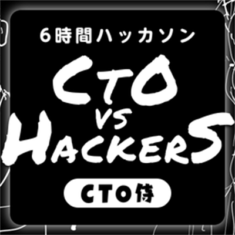
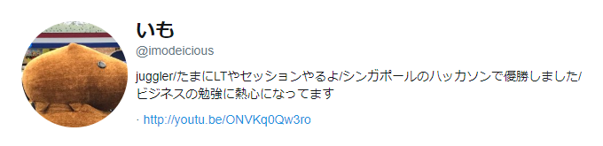
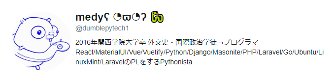
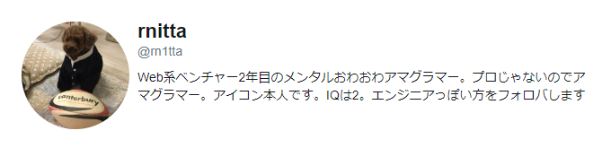
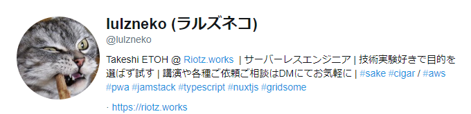
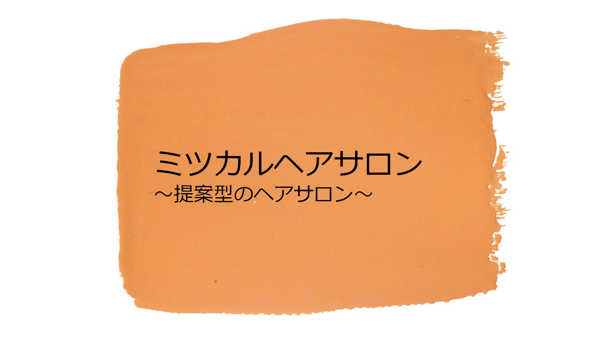
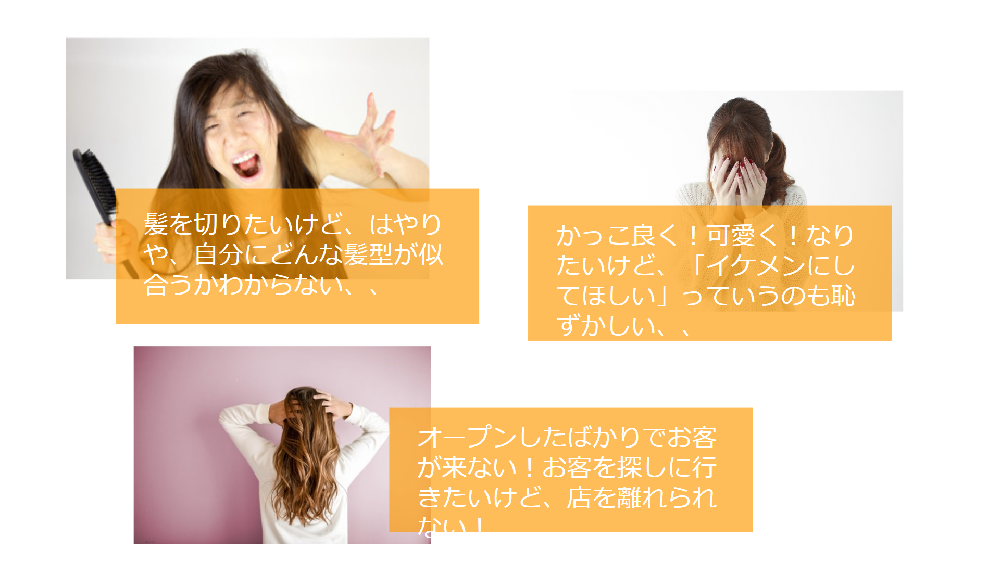
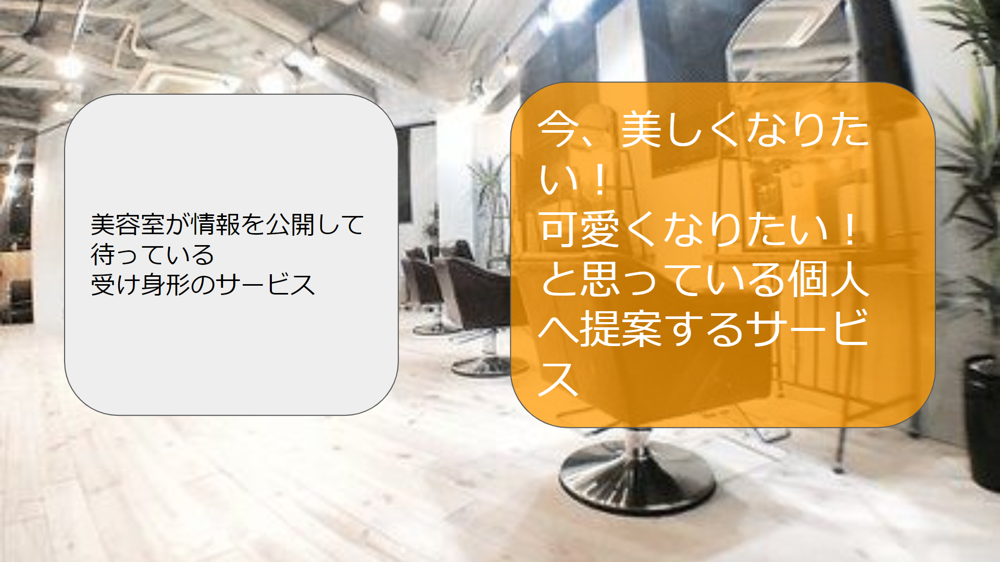

name:「ミツカルヘアサロン💇」〜個人が提案する時代に向けたアプリ～
count: false
class: cover, center, middle
# 「ミツカルヘアサロン💇」
# 〜個人が提案する時代に向けたアプリ～
.event-logo[]
.footer[[@CTO vs Hackers ハッカソン](https://cto-samurai.connpass.com/event/120473/) / 5 min  .small[__\* A material for recording based on slides at time of presentation__]]

---
layout: false
### About us
.center[
  .text-large-48[The Unit of .marker[**CTO-Hackathon Hackers** x **Riotz.works**]]

  .profile[]
  .profile[]
  .profile[]
  .profile[]
]

---
class: no-logo
### オリジナルの発表資料
.center[
  .original[] .original[]
  .original[] .original[]
]

---
count: false
class: bottom, center, backcover
## ご盛況いただき ありがとうございます。
.english[
  It's been a pleasure being with all of you today, thank you.
]

.footer[Thank you for contacting [@lulzneko](https://twitter.com/lulzneko) on .fa[.fa-twitter[]]]

---
class: appendix
### Appendix
**本イベント関連記事**
- [CTO vs Hackers ハッカソン戦記](https://riotz.works/articles/2019/03/10/cto-vs-hackers-hackathon-chronicle/)

**テーマ関連記事**
- [SPAJAM 2019 東京A予選 - ハッカソン戦記](https://riotz.works/articles/2019/05/20/spajam-2019-tokyo-a-pre-hackathon-chronicle/)

---
count: false
class: bottom, center, eof
## EOF

