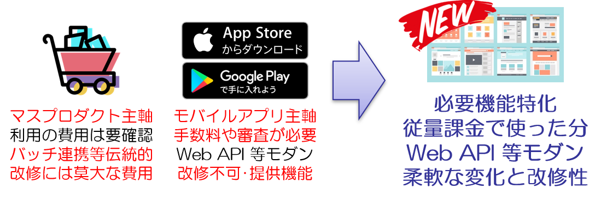

name: １分間ショートピッチ ＠New Biz アイデアソン
count: false
class: cover, center, middle
# １分間ショートピッチ .small[＠New Biz アイデアソン]
.english[
  1 minute short pitch at the New Biz Ideathon
]
.footer[@New Biz アイデアソン [CLOSED] / 1 min per page  .small[__\* A generalized material for publicizing based on slides at time of presentation__]]

---
### 補足
本資料はアイデアソンで１分間ショートピッチに使用したスライドをまとめたものです。

１分間ショートピッチは１スライドのみを表示し１分間でアイデアを説明します。

１分を経過した場合は話の途中でも終了し説明は打ち切りです。

---
### サブスクリプション販売向け eコマースプラットフォーム構築
#### キーポイント
- サブスクリプションやデジタルコンテンツ販売を容易に実現
- Web API 連携等のモダンな機能で Biz や Tech をサポート
- マルチテナント化の実現によって専門のストアを持つことも可能

.center[
  .img-oneminsp[]
]

---
### IoT データ活用プラットフォーム構築
#### キーポイント
- データ公開を特別な追加の開発なしに安全で容易に実現

- データ利用の促進でプロダクトにさらなる魅力を

- データの連携によるサービス開発の実現

.center[
  .img-oneminsp[]
]

---
count: false
class: bottom, center, eof
## EOF

