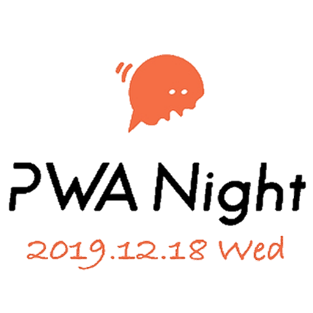

name: WordPress と SSG で作る、情報発信サイト の JAMstack な PWA
count: false
class: cover, center, middle
# WordPress と SSG で作る、
# 情報発信サイト の JAMstack な PWA
.event-logo[]
.english[
  PWA w/JAMstack of information distribution website created with WordPress and SSG
]
.footer[[@PWA Night vol.11](https://pwanight.connpass.com/event/156622/) / 20 min]

---
count: false
class: preface, agenda
### Agenda
1. WordPress の 世界 と ウェブフロント開発における潮流, JAMstack/SSG .english[
  WordPress world and Trends in webfront development, JAMstack and SSG
]

2. WordPress + SSG = Headless WordPress CMS と その魅力 .english[
  WordPress with SSG is Headless WordPress CMS and its attracts
]

3. 情報発信サイト における PWA .english[
  PWA on information distribution website
]

5. まとめ .english[
  Wrap-up
]

---
class: center, middle
## About us
---
layout: false
### About us
.center[
  .text-large-48[.marker[Riotz.works]], a cheerful engineering team !!  
  .small["サーバーレスはエンジニアにとって最強の武器" を 標榜するエンジニアチーム！]  

  .resize-h320-box[.resize-w240-h320[] .img-text[lulzneko]]
  .resize-h320-box[.resize-w240-h320[] .img-text[lopburny]]
  .resize-h320-box[.resize-w240-h320[] .img-text[javaponny]]
]
.footnote[※ 発言や投稿は私的なものであり、所属する企業や組織とは関係ありません。また Riotz.works は 開発チームの名称です。  ]

---
layout: false
### lulzneko .small[(ラルズネコ)] | About us
.ui.grid[
.eleven.wide.column[
  .marker[**サーバーレスなサーバーサイド・エンジニア**]。 新しい技術が大好きで 
  試すためには目的を選ばない、IT好きで葉巻好き酒好きなだけの猫。

  アイデアを高速で形するアーキとして .marker[**サーバーレスが大のお気に入り**]。何かを作る時もサーバーレスでいけるか最初に考える。

  またフロントの技術として Vue.js/Nuxt.js の 高速な開発力に、  
  .marker[**Vue.js/Nuxt.js に心酔**] し、また .marker[**JAMstack/PWA なフロントに興味津々**]。

  ウェブサービスやアプリ開発だけでなく Raspberry Pi などの電子工作や Slack などのチャットボットなどと、いろいろと手を出す。
]
.four.wide.column[].prof[
  .resize-w240[]  
  .social[.fa[.fa-twitter[]] [@lulzneko](https://twitter.com/lulzneko)]  
  .social[.fa[.fa-github[]] [@lulzneko](https://github.com/lulzneko)]  
  .mail[.fa[.fa-envelope-o[]] lulzneko@riotz.works]  

  .small[
  主な発表歴
  - Developers Summit 2019
  - WordCamp Tokyo 2019
  - CloudNative Days Tokyo 2019
  - JAWS Days 2019
  - 東京 Node 学園祭 2019
  - Serverlessconf Tokyo 2018
  - JJUG CCC 2018
  ]
]

.footnote[
  ※ 発言や投稿は私的なものであり、所属する企業や組織とは関係ありません。  
  　 また Riotz.works は 開発チームの名称です。  
]]

---
class: center, middle
## WordPress 㮠世界 㨠 ウェブフロント開発ã«ãŠã‘ã‚‹æ½®æµ, JAMstack/SSG .english[
  WordPress world and Trends in webfront development, JAMstack and SSG
]
---
### WordPress の 世界
- 世界でもっとも使われている .marker[CMS であり]、.marker[ウェブサイト でもある]

- 豊富なプラグインとテーマによる高いカスタマイズ性が特徴

- 個人からビジネスまで幅広く使われている

.img-wordpress[
  
  
  
]

---
### WordPress の ウェブフロント = WordPress テーマ
- 豊富なテーマがテーマディレクトリにそろっている

- テーマによってブログサイトからコーポレートサイトまでとイメージがガラリと変わる

- もちろん、個人でも自由にテーマを開発することが可能！

.img-wordpress-theme[
  
  
  
]

---
### WordPress テーマ 開発における困り事
- HTML, CSS, JavaScript に加えて、PHP の 知識やスキルも必要となる

- もちろん WordPress 自体、たとえばディレクトリ構成や関数なども知る必要がある

- 参考情報は多数あれど、テーマ ＝ ウェブフロント開発 は 意外と大変...

.img-wordpress[
  
  
  
]

---
### ウェブフロントの技術/手法 を WordPress ウェブフロント開発に
- JAMstack と 呼ばれる、新しいアーキテクチャが注目を集めている

- JAMstack は SSG(Static Site Generator) を 使うことで、比較的容易に開発が進められる

- SSG が PWA(Progressive Web Apps) を サポートしていることで、PWA の 実現もしやすい

.right[.img-jamstackconf[]]

---
### JAMstack の 定義
定義: クライアントサイドJavaScript、再利用可能なAPI、構築済みのマークアップ が **ベース**  
.small[(対義的には、サーバー側で HTML 生成するアーキテクチャを SSR:Server Side Rendering という )]

.arrow-left-center[.text-arrow[.fa[.fa-angle-double-down[]]]]

- **クライアントサイド JavaScript**  
  HTTP リクエスト/レスポンスのようなダイナミックな処理は、  
  完全にクライアント上で実行されるようにする。（フレームワークやバニラなどは問わない）  

- **再利用可能な API**  
  全てのサーバサイド処理、DB処理は HTTPS で アクセスできる再利用可能な Web API にする。  

- .marker[**構築済みのマークアップ**]  
  テンプレート用のマークアップ = HTML は、サイトジェネレータ(= SSG) や ビルドツール で、  
  デプロイ時に事前ビルドし生成している 必要(should) がある。

---
### JAMstack = SSG を使うことの メリット
- **より良いパフォーマンス** ＆ **より安価で簡単なスケーリング**  
  HTML 生成の処理が不要で、すべて CDN へ 配置済みにできるため、CDN を フル活用できる

- **より高いセキュリティ**  
  HTML 生成処理 の オフライン化、 
  CDN によるセキュリティの局所化  

- **より良質な開発者エクスペリエンス**  
  データ と マークアップ の分離  
  開発ターゲットと責務の明確化  
  .arrow-left-150[.text-arrow-medium[.fa[.fa-angle-double-down[]]]]  
  **WordPress テーマ開発の懸念点の**  
  **解決につながるのではないか！？**  

.img-jamstack[]

---
### JAMstack を 構築する、おもな SSG
**より良質な開発者エクスペリエンス**、データ と マークアップ の分離 は SSG が実現してくれる  
これらの SSG は WordPress と うまく組み合わせられるのか、組み合わせるとどうなるか？

.ui.grid[
.six.wide.column[
StaticGen - .url[.small[[https://www.staticgen.com](https://www.staticgen.com/)]]
.img-staitc-gen[]
]
.nine.wide.column[.static-gen[
**サイト系**
- [**Gatsby**](https://www.gatsbyjs.org/)   - JavaScript, React, GraphQL

- [Hexo](https://hexo.io/)     - JavaScript, EJS, Pug, Haml, Swig...

- [VuePress](https://vuepress.vuejs.org/) - JavaScript, Vue.js, Vue.js-OFFICIAL

- [**Gridsome**](https://gridsome.org/) - JavaScript. Vue.js, GraphQL

**アプリ系**
- [**Next.js**](https://nextjs.org/)  - JavaScript, React

- [**Nuxt.js**](https://nuxtjs.org/)  - JavaScript, Vue.js
]]]

---
class: center, middle
## WordPress + SSG = Headless WordPress と その魅力 .english[
  WordPress with SSG is Headless WordPress CMS and its attracts
]
---
### WordPress と SSG の 組み合わせ方
WordPress の REST API 経由で SSG と連携する

- GatsbyJS, Gridsome などは Plugin で 直接 WordPress へアクセス、完全に静的化

- Nuxt.js などは HTTP Client 経由で WordPress へ アクセス、動的な描画 (完全な静的化も可能)

.right[.img-wordpress-ssg[
  
  
]]

---
class: no-logo
### WordPress ＋ SSG が もたらすもの
- No.1 CMS である WordPress の エディター と コンテンツ管理 を そのままに活かせる

- ウェブフロント の JAMstack 化によるメリットを享受 .small[(パフォーマンス、スケーリング、セキュリティ)]

- ウェブフロント開発者 の "Better Developer Experience" .small[(データ と マークアップ の分離、責務の明確化)]

.arrow-left-150[.text-arrow-medium[.fa[.fa-angle-double-down[]]]]  

.img-12[]

このような CMS の 使い方、 
使われ方をする CMS を  
**Headless CMS** という 

⇒ **Headless WordPress CMS**

---
### 代表的な Headless CMS
.ui.grid[
.nine.wide.column[
- [Contentful](https://www.contentful.com/) - API Driven

- [GraphCMS](https://graphcms.com/) - API Driven, GraphQL

- **[microCMS](https://microcms.io/) - API Driven, 日本製･日本語対応**

.arrow-left-150[.text-arrow-medium[.fa[.fa-angle-double-down[]]]]

最近注目を集め始めているが、まだまだ情報が少ない  
その注目もエンジニアが中心と見える  

**⇒ Headless WordPress CMS にも、勝機はありそうだ！**
]
.six.wide.column[
headlessCMS - .url[.small[[https://headlesscms.org](https://headlesscms.org/)]]
.img-staitc-gen[]
]]

.footnote[※ ここでは Serverless(Managed, SaaS) の Headless CMS を対象としてリストアップ]

---
### Headless CMS としての WordPress の 魅力
**コンテンツを書くのは誰か？、誰が使うのか？**

- 企業や団体の情報発信として考えた場合に、かなずしも IT に強いとは限らない

- 少ない人数で運用しているケースも多く、頼り先が得られないこともある

- 伝承が途切れたり、操作の難しさや助けが得られないことから誤用や事故につながることも...

.arrow-left-150[.text-arrow-medium[.fa[.fa-angle-double-down[]]]]

WordPress を コンテンツの作成者や管理者としての観点から見た時に  
「世界でもっとも使われている CMS」であり、多くの情報が書籍やウェブサイトとして溢れてる。  
何よりも使っている人、使ったことがある人が多いことが助けにつながるというメリットがある。  

---
### 魅力があれども WordPress の 運用が...
.text-large-32[
  WordPress を Headless CMS として使うメリットは分かった。  
  だが WordPress を 運用するとなれば、話は別だ！
]

.arrow-left-center[.text-arrow-large[.fa[.fa-angle-double-down[]]]]

- OS, PHP, DB, WordPress の 技術スタック

- セキュリティ対策と継続的なアップデート

- むしろ、あまり必要としていなかった  
  Node.js/SSG の 技術スタックが追加  

.img-10[
  
]

---
class: no-logo
### WordPress を Serverless .small[(Managed WordPress, WordPress SaaS)] にする
- WordPress の 実行基盤を Serverless、あるいは Managed や as a Service にする

- サービスとしての WordPress とし、所有ではなく利用することで構築や運用の負担をなくす

- コンテンツの作成と管理をサービスとしての WordPress 利用、ウェブフロントを SSG 構築にする

.center[.text-arrow-large[.fa[.fa-angle-double-down[]]]]

Serverless 化 こそ WordPress を Headless CMS として使うための重要な要素  

技術スタックを増加させず、逆にサービス利用によって構築･運用の負担を低減  

SSG を 使った ウェブフロント開発に注力することができる  

---
### 具体例: Shifter .small[ － Serverless な WordPress による Headless WordPress CMS + SSG]
**Shifter : Serverless な WordPress**  
.small[.url[https://www.getshifter.io/japanese/]]  

- Shifter(= WordPress) が データソースの 
  　SSG プロジェクトを Netlify へ 配置する

- Shifter が ビルド時に Netlify Webhooks を 呼出す

- SSG で Shifter コンテンツ を ウェブサイト化

.arrow-left-center[.text-arrow[.fa[.fa-angle-double-down[]]]]

GatsbyJS や Gridsome などが WordPress を データソースにできるのを利用。  
Shifter が Webhooks と組み合わせてくれたことにより、SSG による サイト構築を実現。  

.img-webhooks[
    
  .small[.url[https://www.digitalcube.jp/shifter/4434/]]  
]

---
class: center, middle
## 情報発信サイト における PWA .english[
  PWA on information distribution website
]
---
### PWA とは
- ウェブサイトをネイティブアプリのような UI/UX にする次世代規格

- Google が中心で策定し Microsoft も参画、Apple の対応が待たれる

- インストール、オフライン動作、プッシュ通知、GPS  
  Bluetooth、NFC などが使える .small[(機種依存や実験的実装もあるが)]  
  ⇒ What Web Can Do Today .small[.url[https://whatwebcando.today]]

.arrow-left-150[.text-arrow-medium[.fa[.fa-angle-double-down[]]]]  

"クライアントサイド の JavaScript",  
"再利用可能な API" という 
JAMstack の 観点と相性が良く開発しやすいともいえる  

.img-pwa[
  
    
  左はブラウザ、右は PWA 
]

---
### SSG で PWA を実装する
- Plugin を 導入し、Web App Manifest と Service Worker の 設定をする

- 各種 HTML5 APIs や サービス連携 を使って、アプリ機能を実現する

.arrow-left-150[.text-arrow-medium[.fa[.fa-angle-double-down[]]]]  

ハッカソン製作作品  
「ラップ、タップ、アップ 🎶」  
.small[.url[https://riotz.works/rap-tap-app/]]  
.small[(CMS は関係ないですが SSG + PWA の 例として)]  

SSG として Nuxt.js を利用  
アプリのフレームを JAMstack で構築  
動画の中継と配信はサービス利用で実現

<section class="video">

<iframe src="https://riotz.works/rap-tap-app/" frameborder="0" align="left" style="transform-origin: 0px 0px 0px;"></iframe>

</section>
.img-raptapapp2[]

---
### 情報発信サイト としての PWA
- ウェブサイトをアプリとしてインストールできるようにする

- "アプリ" という機能はほぼなく、記事などのソースのキャッシュやオフライン化がメイン

- コンテンツの更新をアプリ通知することができるが、そこはメインではないかも

.arrow-left-150[.text-arrow-medium[.fa[.fa-angle-double-down[]]]]  

日本経済新聞社は複数ページのPWAで新しいレベルの品質とパフォーマンスを実現  |  Web  |  Google Developers https://developers.google.com/web/showcase/2018/nikkei?hl=ja

Yahoo! JAPANトップページ（スマートフォン）におけるPWAの取り組み〜ホーム画面追加編〜 - Yahoo! JAPAN Tech Blog https://techblog.yahoo.co.jp/advent-calendar-2018/yahoo-toppage-a2hs/

---
class: center, middle
## まとめ .english[
  Wrap-up
]
---
class: wrapup
### まとめ .english[
  Wrap-up
]
- **JAMstack (= SSG 利用) なサイトは、メリットが大きい**  
  ⇒ パフォーマンス、スケーリング、セキュリティの向上が図れる  

- **WordPress を Headless CMS として使い、JAMstack のメリットを享受**  
  ⇒ 使いやすく情報が多い、Serverless WordPress で 運用の負荷も軽減  

- **SSG を使うことで PWA が作りやすく、PWA は CMS とも相性が良い**  
  ⇒ むしろ "情報のオフライン化" こそ、情報発信サイト PWA の 真骨頂  

---
count: false
class: bottom, center, backcover
## ご清聴いただき ありがとうございました。
.english[
  It's been a pleasure being with all of you today, thank you.
]

.footer[Thank you for contacting [@lulzneko](https://twitter.com/lulzneko) on .fa[.fa-twitter[]]]

---
count: false
class: bottom, center, eof
## EOF

