name: pact
count: false
class: cover, center, middle

## Pact (Consumer-Driven Contract Testing) 
## を使ってサーバーレスの非同期テストの
## やりづらさを解決できるか
.event-logo-wide[[](https://serverless.connpass.com/event/184557/)]
.footer[[@Serverless Meetup Japan Virtual #4](https://serverless.connpass.com/event/184557/) / 20 min]

---
count: false
class: preface, agenda
### Agenda
- サーバーレスなアプリケーションの結合テストにおける悩み
- Pact を使ったテスト手法の紹介
- Pact のテストを導入するメリット
- Pact を使っても解決しないこと
- まとめ

---
layout: false
class: no-logo
### About us
.center[
  .text-large-48[.marker[Riotz.works]], a cheerful engineering team !!

  .resize-h320-box[.resize-w240-h320[] .img-text[lulzneko]]
  .resize-h320-box[.resize-w240-h320[] .img-text[lopburny]]
  .resize-h320-box[.resize-w240-h320[] .img-text[javaponny]]
]
.footnote[※ 発言や投稿は私的なものであり、所属する企業や組織とは関係ありません。また Riotz.works は 開発チームの名称です。  ]


---
class: center, middle, no-logo
## サーバーレスなアプリケーションの
## 結合テストにおける悩み


---
### まずは、端的にみてモノリスな構成の WebAPI の場合
- 最もベーシックな構成

- リクエスト送って期待した通りのレスポンスが返ってくることをアサーションする
.img-01[
  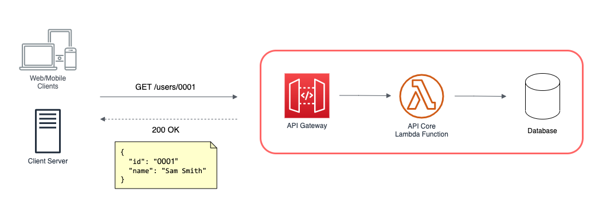
]

---
### 複数のマイクロサービスからなる API 構成の場合
.ui.grid[

.six.wide.column[
- 現実は、どんどんマイクロサービスが増えていく

- シーケンスに複数のマイクロサービスが関わるようになり、サービス間の互換性を保つすることが大変になってくる

- テストを行う範囲が増大し、結合を担保するため E2E テストに依存するようになっていく
]
.nine.wide.column[
.img-02[
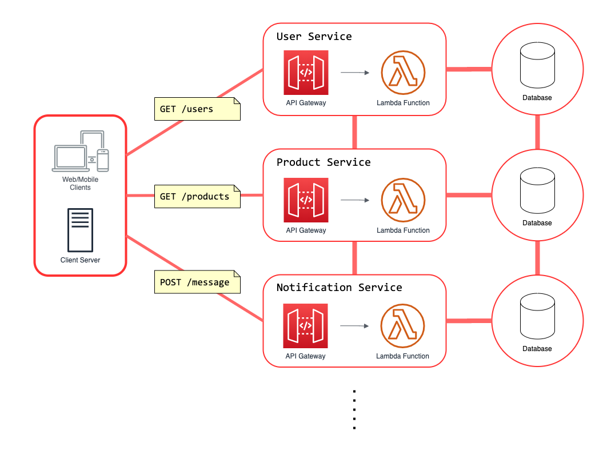
]
]
]

---
### Event-Driven で非同期な処理が続く場合
.ui.grid[

.nine.wide.column[
- 開発が進むに連れて、非同期に動くコンポーネント間の仕様管理とテストがきちんとしづらくなる

- 全体としての動作を担保するためには、クラウド環境に一旦デプロイしてパターンごとに E2E テストを行う必要がある

- 終端までのテスト結果をアサーションするには、ポーリングで結果を待ち受けるといったアプローチになり、そのタイミングが不明瞭かつ時間がかかる


Pact の非同期APIテストの手法を使えば、この状況を改善できるだろうか・・？
]
.six.wide.column[
.img-03[
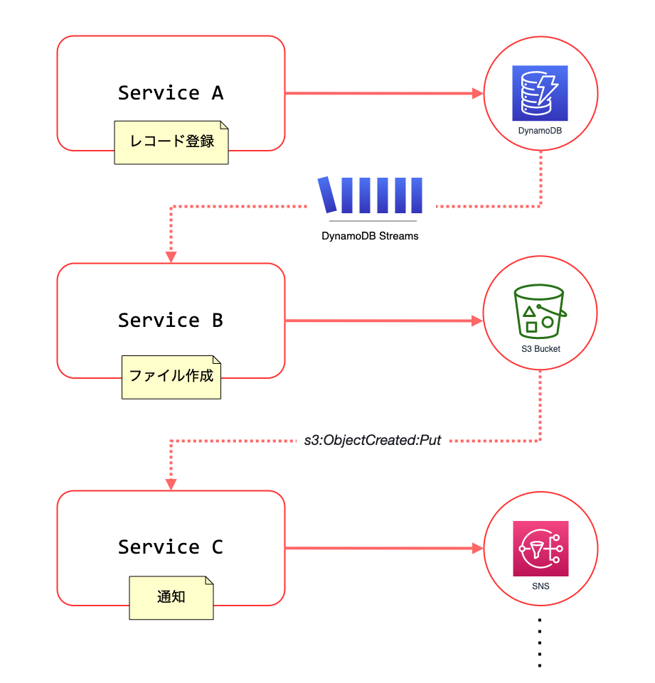
]
]
]

---
class: center, middle, no-logo
## Pact を使ったテスト手法の紹介

---
### Pactとは？

- Consumer-Driven Contract Testing を実装した、インテグレーションテストをサポートするツールセット

- 以下を基本的な構成として、Consumer と Provider の間で契約（Contract）を結ぶことによって連携の整合性を保つ仕組み

  - .text-large-24[.marker[`Consumer`]]
      - データを要求する側（クライアント）

  - .text-large-24[.marker[`Provider / Producer`]]
      - データを提供する側（API サーバー）

  - .text-large-24[.marker[`Pact` ブローカー]]
      - `Consumer ↔ Provider` の間で結ばれた契約内容とインタラクション（req/res のペア）を仲介・管理

---
### Pactとは？
- Provider は Consumer が定義した契約を守らなければならず、それぞれの CI に組み込むことで、意図しない破壊的変更を「デプロイ前」に検知することができる


.ui.grid[
.eleven.wide.column[

- API クライアント ↔ サーバー間のテストだけでなく、Event-Driven なコンポネント間のテストをする方法もある

  - HTTP API Testing (Pact)

  - Asynchronous API Testing (MessagePact)

- 様々な言語でコア機能及びライブラリがOSSで開発されている

]
.four.wide.column[
.img-04[
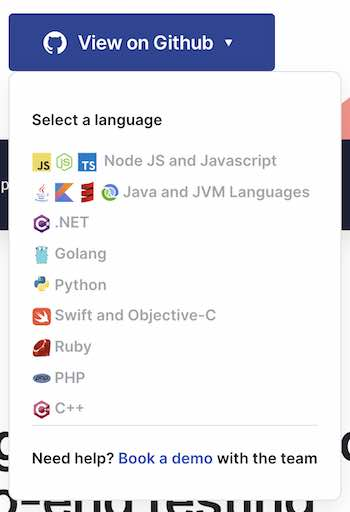
]
]
]

---
### HTTP API Testing
① `Consumer` は期待する `Provider` の振る舞いを定義し、その通りに動くモックサーバー（Pact）を起動してテストを実行

② `Consumer` テスト後に生成された `Pactfile`（`Consumer` が期待するインタラクションが定義されたもの）を `Pact` ブローカーにアップロードする

.img-05[
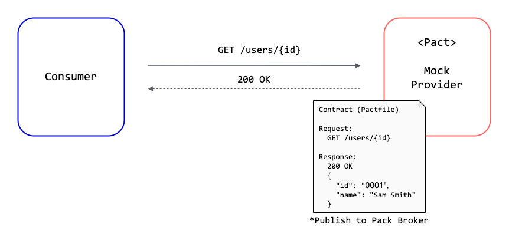
]

---
### HTTP API Testing
③ `Provider` は Pact ブローカーから契約内容をロードして、自身がその通りに動くか検証

④ `Provider` 検証時にら契約内容の記載と異なる動きをすればエラーになる（仕様変更を検知できる）

.img-06[
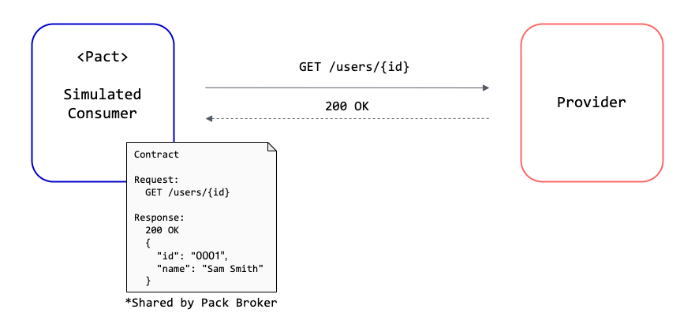
]

---
### HTTP API Testing
全体で見ると、こうなります


.img-07[
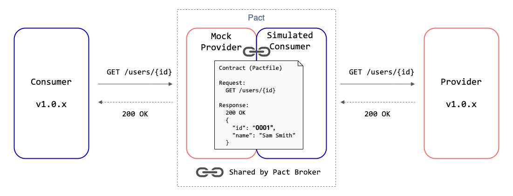
]

---
### Pact ブローカー（Pactflow）画面の例

.ui.grid[
.three.wide.column[
Provider 検証前
]
.twelve.wide.column[
.img-08[
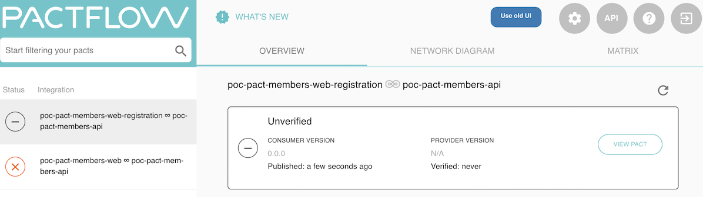
]
]

.three.wide.column[
Provider 検証後
]
.twelve.wide.column[
.img-09[
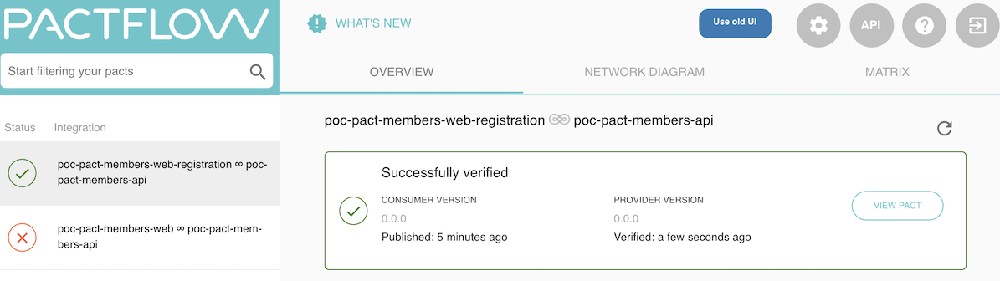
]
]
]

---
### Pact ブローカー（Pactflow）画面の例
複雑なマイクロサービス・ファミリーのサービスマップ(Network Diagram) の表示例

.img-10[
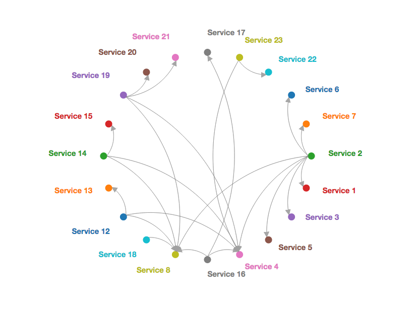
]

.centered-small[
※ Pact Broker GitHub Repository - README.md より抜粋  
https://github.com/pact-foundation/pact_broker#network-diagram
]

---
### Pactfile (契約内容) の例

.ui.grid[
.seven.wide.column[
.text-size-code[
```json
{
  "consumer": {
    "name": "poc-pact-members-web"
  },
  "provider": {
    "name": "poc-pact-members-api"
  },
  "metadata": {
    "pactSpecification": {
      "version": "2.0.0"
    }
  },

  // →
```
]
]
.eight.wide.column[
.text-size-code[
```json
  // ↓

  "interactions": [
    {
      "description": "Interaction for member registration",
      "providerState": "Member registration",
      "request": {
        "method": "POST",
        "path": "/member",
        "headers": {
          "Content-Type": "application/json;charset=utf-8"
        },
        "body": {
          "userId": "user_id",
          "nickname": "user_nickname",
          "ageGroup": "thirties"
        }
      },
      "response": {
        "status": 200,
        "headers": {
          "Content-Type": "application/json"
        },
        "body": {
          "userId": "user_id",
          "nickname": "user_nickname",
          "ageGroup": "thirties"
        }
      }
    }
  ]
}
```
]
]
]


---
### Consumer 側のサンプルコード
.xsmall[
※表現及び説明の都合上、実際に動作させるための設定等を省略した部分があります。
]
.ui.grid[
.seven.wide.column[
.text-size-code[
```javascript

const { pactWith } = require('jest-pact')

pactWith({
  consumer: 'poc-pact-members-web',
  provider: 'poc-pact-members-api',
  dir: path.resolve(process.cwd(), '.pacts/pactFiles'),
}, provider => {

  const apiClient = new ApiClient({
    API_BASE_URL: provider.mockService.baseUrl
  })

// →

```
]
]
.eight.wide.column[
.text-size-code[
```javascript
  provider.addInteraction({

    state: 'Registration',

    withRequest: {
      method: 'POST',
      path: '/members',
      headers: { /* ... */ },
      body: { /* ... */ },
    },

    willRespondWith: {
      status: 200,
      headers: { /* ... */ },
      body: { /* ... */ },
    },
  })

  test('Testing registration API interaction', async () => { 

    // モックサーバーにリクエストを投げてテストを実行
    const expected = EXPECTED_RESULT
    const actual = await apiClient.register(REQUEST_BODY)

    expect(actual).toEqual(expected)
  })

})
```
]
]
]

---
### Pact ブローカーへ Publish するサンプルコード
.xsmall[
※表現及び説明の都合上、実際に動作させるための設定等を省略した部分があります。
]

.text-size-code[
```javascript
const pact = require('@pact-foundation/pact-node')

pact.publishPacts({
  pactFilesOrDirs: [
    path.resolve(process.cwd(), '.pacts/pactFiles')
  ],
  pactBroker: PACT_BROKER_ENDPOINT,
  pactBrokerToken: PACT_BROKER_TOKEN,
  tags: [
    'develop'
  ],
  consumerVersion: '0.0.0'
})
```
]

---
### Provider 側のサンプルコード
.xsmall[
※表現及び説明の都合上、実際に動作させるための設定等を省略した部分があります。
]

.text-size-code[
```javascript
const { Verifier } = require('@pact-foundation/pact')

describe('Provider Test', () => {

  const opts = {
    provider: 'poc-pact-members-api',
    providerVersion: '0.0.0',
    consumerVersionTags: [
      'develop'
    ],
    publishVerificationResult: true,
    providerBaseUrl: PROVIDER_BASE_URL, // ローカルまたはテスト専用環境で API を立てておく
    pactBrokerUrl: PACT_BROKER_URL,
    pactBrokerToken: PACT_BROKER_TOKEN,
  }

  test('Verify pact interactions', async () => {

    // 予め立てておいた API (自分自身）に対して
    // Interactions に定義した通りのリクエストを投げて検証
    const result = await new Verifier(opts).verifyProvider()
    expect(result).toBeTruthy()
  })
})
```
]


---
### Asynchronous API Testing
HTTP API Testing の仕組みを拡張・応用し、非同期なインタラクションのテストを行う手段もある

> Introduces messages for services that communicate via event streams and message queues.
This proposal is to introduce a non-request/response interaction to support message queues
where the flow may be one way. Pact file format will be expanded to be able to include:
...


> ※ Pact Specification Version 3 より抜粋  
https://github.com/pact-foundation/pact-specification/tree/version-3#introduces-messages-for-services-that-communicate-via-event-streams-and-message-queues

---
### Asynchronous API Testing
- HTTP API Testing .marker[「モックサーバー」] → Asynchronous API Testing  .marker[「メッセージキュー」]

- AWS でいう SQS, SNS, Kinesis, DynamoDB Streams 等をメッセージキューに置き換えてテストを行う仕組み

- Pactfile には Consumer が想定しているメッセージの内容とそのスキーマが出力される

  - .marker[`Consumer`]
      - メッセージを受け取ってハンドリングする側（イベントハンドラー）
      - メッセージを検証するためのスキーマやパターンの指定ができる

  - .marker[`Producer (Provider)`]
      - メッセージキューにメッセージを入れる側（イベントパブリッシャー）
      - Consumer の期待にマッチするメッセージを送れるかどうかが検証される

---
### Asynchronous API Testing
全体でみたイメージとコンセプトを説明します

.img-11[
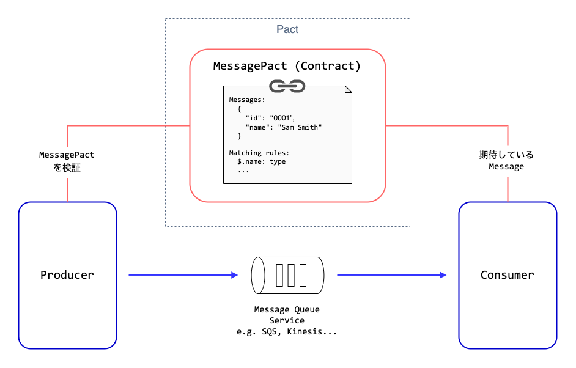
]

---
### Asynchronous API Testing
例えばこういう構成のサービスコンポーネントがあるとすると、契約範囲はこうなります

.img-12[
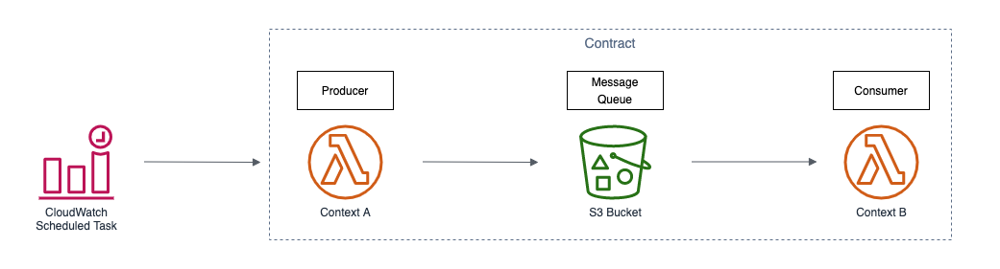
]

---
### Asynchronous API Testing
- （少し契約の数を増やして）Pactflow で見た Network Diagram の表示例
  - 上から `Consumer → Producer/Consumer → Producer` の順で表示されている

.img-13[
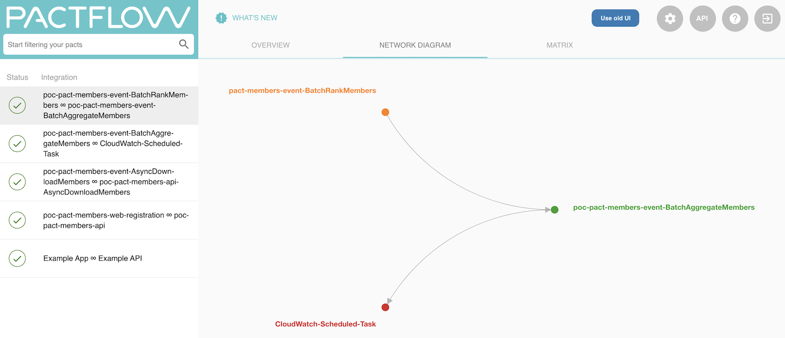
]

---
### Consumer 側のサンプルコード

.xsmall[
※表現及び説明の都合上、実際に動作させるための設定等を省略した部分があります。
]

.text-size-code[
```javascript
const { MessageConsumerPact, Message, Matchers } = require('@pact-foundation/pact')

test('Testing Event-Consumer', async () => {

  await new MessageConsumerPact()

    .expectsToReceive('AsyncEvent')

    // Expected event payload
    .withContent({ 
      EventSubscriber: like(subscriber_id),
      Payload: { Message: like(message) }
    })

    .verify(async (m: Message) => {
      await asynEventAction.handle(m.contents)
      // Additional Testing or Assertion
    })
})
```
]

---
### Producer 側のサンプルコード

.xsmall[
※表現及び説明の都合上、実際に動作させるための設定等を省略した部分があります。
]

.text-size-code[
```javascript
const { Verifier, MessageProviderPact } = require('@pact-foundation/pact')

test('Verify Event-Producer', async () => {

  const messageProviderPact = new MessageProviderPact({

    provider: 'AsyncEventProducer',

    messageProviders: {
      'AsyncEvent': async () => {
        // Provide an actual event payload
        return await createAsyncEvent()
      }
    },

    pactBrokerUrl: PACT_BROKER_URL,
    pactBrokerToken: PACT_BROKER_TOKEN,
    publishVerificationResult: true,
    providerVersion: '0.0.0' 
  })

  await messageProviderPact.verify()
})
```
]

---
### Pactfile (契約内容) の例

.ui.grid[
.seven.wide.column[
.text-size-code[
```json
{
  "consumer": {
    "name": "exporter-context"
  },
  "provider": {
    "name": "aggregator-context"
  },
  "metadata": {
    "pactSpecification": {
      "version": "3.0.0"
    }
  },

  // →
```
]
]
.eight.wide.column[
.text-size-code[
```json
  // ↓

  "messages": [
    {
      "description": "Aggregation process",
      "providerStates": [ "CompletedExtraction" ],
      "contents": {
        "EventSubscriber": "...",
        "Payload": {
          "Message": "..."
        }
      },
      "matchingRules": {
        "body": {
          "$.EventSubscriber": {
            "matchers": [
              { "match": "type" }
            ]
          },
          "$.Payload.Message": {
            "matchers": [
              { "match": "type" }
            ]
          }
        }
      }
    }
  ]
}
```
]
]
]

---
class: center, middle, no-logo
## これでサーバーレスなアプリケーションの
## 非同期テストのやりづらさを解決できる？


---
### Pact のテストを導入するメリット
- .marker[「一般的に」] Pact を導入してうれしくなること
  - Consumer ↔ Provider 間で整合性が担保された仕様が確立する

  - 互換性を壊さず変更を加えることが比較的容易になる 

  - 仕様の不整合や意図しない破壊的変更を検知するための E2E テストへの依存を減せる

- .marker[「サーバーレス」のコンテキスト]でうれしくなること

  - イベントペイロードについてもスキーマのバージョン管理でき、可視性と保守性が向上する

  - ローカル環境でもモックを用意することなく「メッセージキュー」パターンのテストができる

---
### Pact を使っても解決しないこと

.ui.grid[
.six.wide.column[
- 非同期なテストを.marker[よりシンプルまたは直感的]にすること 

- E2E テストによる.marker[機能の検証]、またはそれにかかるコスト（回数・時間・メンテ）を減らすこと 

- Pact API のスコープ外（.marker[「メッセージキュー」以外のパターン]）のテストをローカル環境で行うこと
]

.nine.wide.column[
.img-14[
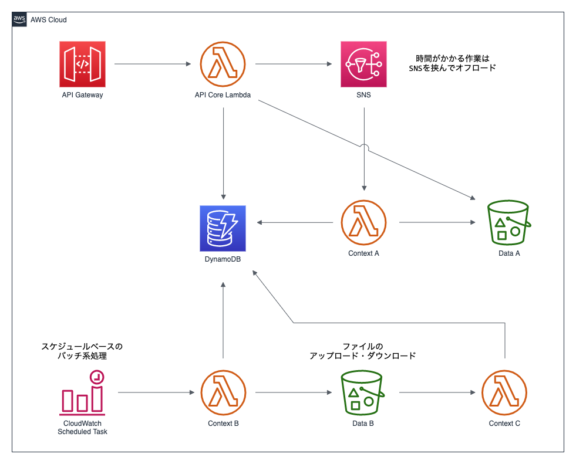
]
]
]

---
class: center, middle, no-logo
## まとめ

---
### まとめ
- Pact はテストを楽にするためのものではなく、コンポーネント間の仕様を明確化・管理することで、本来 E2E テストでカバーすべきではないテストを減らし、よりよいシステムデザインと継続的な開発に役立てるもの

- サーバーレスの非同期テストのやりづらさについてのアプローチは、一旦原点回帰してテストしやすい設計を意識する必要がある
  - クラウドコンポーネントに依存するレイヤーとビジネスロジックを分離し、 
    DI ができるようにするなど、コンテキストの変換が容易になるように工夫する

  - 個々のサービスの役割と責任範囲がなるべく小さくなるように構成する

  - 実装は最小限に抑え、テストを行うスコープとポリシーを明確に定めておく

---
class: center, no-logo
### Special Thanks
.img-15[

]

---
class: center, no-logo
### ポッドキャストやってます🎙️
.img-16[

]
Apple/Google/Spotifyで配信中！

https://serverless.fm

---
### 参考資料ー詳細が気になる方は要チェック

.small[

- Pact 公式サイト・ドキュメント  
  🔗 https://pact.io


- Pact JS  
  🔗 https://github.com/pact-foundation/pact-js


- Pact Broker  
  🔗 https://github.com/pact-foundation/pact_broker


- Pactflow  
  🔗 https://pactflow.io


- Contract Testing Serverless and Asynchronous Applications  
  🔗 https://dius.com.au/2017/09/22/contract-testing-serverless-and-asynchronous-applications


- 実践 Pact:マイクロサービス時代のテストツール  
  🔗 https://techlife.cookpad.com/entry/2016/06/28/164247


- Qiita | [Serverless] サーバーレスのテストの難しさと、契約ベースのテストについて 
  🔗 https://qiita.com/hassaku_63/items/9cf9ee2c4f16622859c2
]

---
class: center, middle, no-logo
## ご静聴ありがとうございました。


