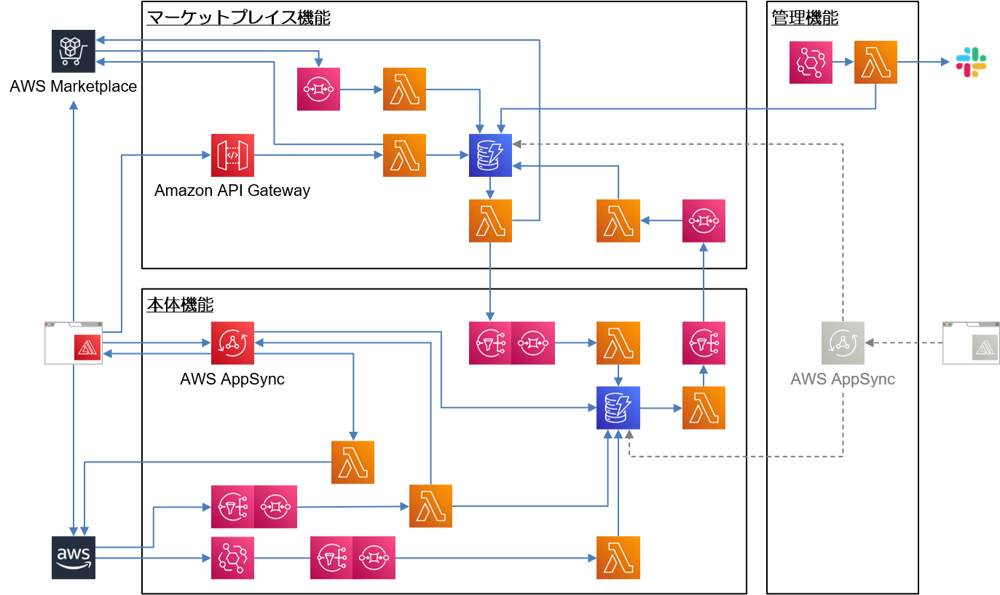
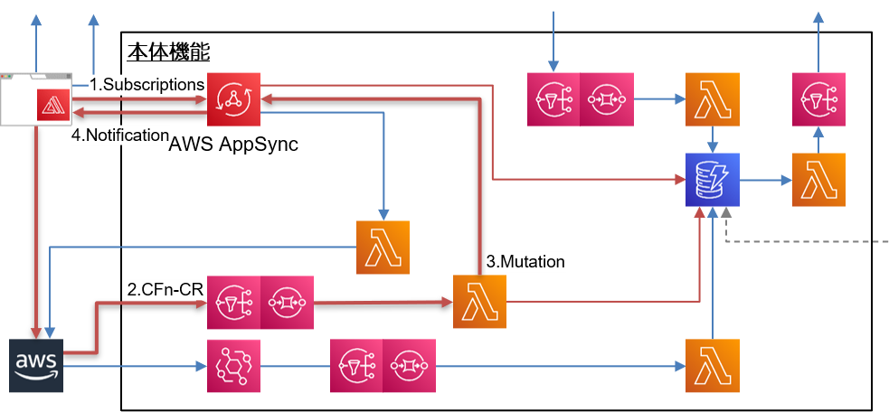

name: 熱心な REST 信者、が 挑んだ AppSync/GraphQL API 開発
count: false
class: cover, center, middle
# 熱心な REST 信者、が 挑んだ AppSync/GraphQL API 開発
.event-logo-wide[]
.english[
  AppSync/GraphQL API Development Challenged by Ardent REST Devotees
]
.footer[[@Serverless Meetup Japan Virtual #14](https://serverless.connpass.com/event/199464/) / 20 min]

---
count: false
class: preface, agenda
### Agenda
1. REST と GraphQL、そして AWS AppSync .english[
  REST, GraphQL, and AWS AppSync
]
2. AppSync/GraphQL で 開発した背景 .english[
  Background of development with AppSync/GraphQL
]
3. REST vs AppSync/GraphQL 開発 の リアル .english[
  REST vs AppSync/GraphQL Realities from Development
]
4. まとめ .english[
  Wrap-up
]

---
class: center, middle
## About us
---
layout: false
### About us
.center[
  .text-large-48[.marker[Riotz.works]], a cheerful engineering team !!

  .resize-h320-box[.resize-w240-h320[] .img-text[lulzneko]]
  .resize-h320-box[.resize-w240-h320[] .img-text[lopburny]]
  .resize-h320-box[.resize-w240-h320[] .img-text[javaponny]]
]
.footnote[※ 発言や投稿は私的なものであり、所属する企業や組織とは関係ありません。また Riotz.works は 開発チームの名称です。  ]

---
layout: false
### lulzneko .small[(ラルズネコ)] | About us
.ui.grid[
.eleven.wide.column[
  .marker[**サーバーレスなサーバーサイド・エンジニア**]。 新しい技術が大好きで  
  試すためには目的を選ばない、IT好きで葉巻好き酒好きなだけの猫。

  アイデアを高速で形するアーキとして .marker[**サーバーレスが大のお気に入り**]。何かを作る時もサーバーレスでいけるか最初に考える。

  またフロントの技術として Vue.js/Nuxt.js の 高速な開発力に、  
  .marker[**Vue.js/Nuxt.js に心酔**] し、また .marker[**JAMstack/PWA なフロントに興味津々**]。

  ウェブサービスやアプリ開発だけでなく Raspberry Pi などの電子工作や Slack などのチャットボットなどと、いろいろと手を出す。
]
.four.wide.column[].prof[
  .resize-w240[]  
  .social[.fa[.fa-twitter[]] [@lulzneko](https://twitter.com/lulzneko)]  
  .social[.fa[.fa-github[]] [@lulzneko](https://github.com/lulzneko)]  
  .mail[.fa[.fa-envelope-o[]] lulzneko&#x40;riotz.works]  

  .small[
  主な発表歴
  - Developers Summit 2019
  - WordCamp Tokyo 2019
  - CloudNative Days Tokyo 2019
  - JAWS Days 2019
  - 東京 Node 学園祭 2019
  - Serverlessconf Tokyo 2018
  - JJUG CCC 2018
  ]
]

.footnote[
  ※ 発言や投稿は私的なものであり、所属する企業や組織とは関係ありません。  
  　 また Riotz.works は 開発チームの名称です。  
]]

---
### 熱心な？、REST 信者
- 2010年頃 REST に注目し社内開発における標準化や活用の推進をしていた
- 自身の開発も REST ベースで  
　　AWS Lambda 登場前は Spring Boot(MVC)、登場後は API Gateway/Lambda
- GraphQL 登場の 2015年、GraphQL Foundation 移管、AppSync GA の 2018年などは、  
  興味を持つものの開発に所属し、すでに REST ベースのサービスを稼働させていたため使わず

.img-trends[
  
    
  .small[※ [Serverlessconf Tokyo 2017 発表資料](https://riotz.works/slides/2017-serverless-conf/#1)、REST ベースのサービス]  
]

---
class: center, middle
## REST と GraphQL、そして AWS AppSync .english[
  REST, GraphQL, and AWS AppSync
]
---
### REST とは
- 正式名 Representational State Transfer で、Web API を定義するためのアーキテクチャスタイル
- 以下の原則に基づいて Web API を作成する
 - ステートレスなクライアント/サーバーの通信とする
 - リソースを URI として一意に識別できるようにする
 - HTTP Methods に合わせた操作を定義する (POST / GET / PUT / DELETE / PATCH)
 - 原則ではないがエラーを HTTP Status で表現することも、よく使われるパターン  
   .small[⇒ `200 OK` でボディにエラーコードを返すのでなく、認証エラーなら `401 Unauthorized` をちゃんと返す]

.table-rest[
  | REST 以前の例                 | REST          |                |
  |:------------------------------|:--------------|:---------------|
  | `HTTP POST /getUser`　　      | `HTTP GET`    | `/users/${id}` |
  | `HTTP POST /getUserList`　　  | `HTTP GET`    | `/users`       |
  | `HTTP POST /createUser`　　   | `HTTP POST`   | `/users`       |
  | `HTTP POST /updateUser`　　   | `HTTP PUT`    | `/users/${id}` |
  | `HTTP POST /deleteUser`　　   | `HTTP DELETE` | `/users/${id}` |
]

---
### GraphQL とは
- 効率的でフレキシブルな Web API を作成するためのクエリー言語

- 大規模なシステムを REST で作る場合のリソース(= URI) 管理の負荷、  
　　また、複数リソースを必要とする場合のクライアント実装の煩雑さの解決から作られた

- Facebook が策定、現在は GraphQL Foundation 管理、実装としては GitHub API v4 などが有名
  

#### 以下のような特徴がある
- すべての操作が１つのエンドポイントで実現できる
- スキーマおよび型定義を用いて Web API のリソースを定義できる
- `取得` と `更新` に加えて、リアルタイムの通知に関する仕様 `Subscriptions` が含まれている
- クライアントがレスポンスに必要な項目を指定してリクエスト(クエリー)できる

---
### AWS AppSync とは
- AWS の サーバーレスな GraphQL サービス

- Lambda や DynamoDB といった AWS サービスをデータソースとするシームレスな連携

- AWS Amplify との連携による、オンライン/オフラインのデータ同期

.center[.img-appsync[
  
]]

---
class: center, middle
## AppSync/GraphQL で 開発した背景 .english[
  Background of development with AppSync/GraphQL
]
---
### AppSync/GraphQL で 開発したサービス
- サーバーレスアーキテクチャに特化したコスト管理サービス  
**Costless** - .url[https://costless.io/ja/]

- AWS アカウント全体 と Lambda などのサービスの毎のコスト状況を可視化

- サービスのリソース・レベルまでコストの発生状況を分析できる

.img-costless[
  
    
  .small[※ 詳細はこちら ⇒ .url[https://serverless.co.jp/news/302/]]
]

---
### Costless の アーキテクチャ図
.img-costless-arch[
  
]

---
### Costless で AppSync を採用した理由
1. お客さま AWS アカウントを連携する際に CFn Custom Resources を使う必要があり、  
   CFn の展開が完了したことを **リアルタイムでフロントエンドへ通知する** 必要があったため  

2. イベント通知を受けたいのは自分がセットしたものだけだった  
   複数ユーザー間や双方向のやり取りなどは不要、API Gateway WebSocket ではオーバースペック

3. 新しい技術は機会を見つけてはチャレンジする、むしろ使うための機会は作り出す！！  
   そのため DynamoDB へアクセスするためだけでは Lambda Resolver を禁止などの使い倒し縛りも

.img-costless-arch2[
  
]

---
### Costless で 利用している主なライブラリ
- **serverless-appsync-plugin** - .small[.url[https://github.com/sid88in/serverless-appsync-plugin]]  
  ⇒ IaC.small[(Infrastructure as Code)]、 AppSync 周りの設定がとても簡単になる

- **TypeScript** - .small[.url[https://www.typescriptlang.org/]]  
  ⇒ JavaScript に型定義を導入し開発生産性とコードの品質を向上できる

- **TSyringe** - .small[.url[https://github.com/microsoft/tsyringe]]  
  ⇒ DI.small[(Dependency Injection)]、コード内の依存関係を簡略化し品質とテスタビリティを高める

- **DAZN Lambda Powertools** - .small[.url[https://github.com/getndazn/dazn-lambda-powertools]]  
  ⇒ DynamoDB Streams や SNS/SQS などに correlation-id を伝搬しトレサビリティを確保

.footnote[※ Amplify CLI は使用しなかった ⇒ 今後の管理機能実装などで使い勝手や使いどころを見極めたい]

---
class: center, middle
## REST vs AppSync/GraphQL 開発 の リアル .english[
  REST vs AppSync/GraphQL Realities from Development
]
.left[.footnote[※ 個人＆バックエンド実装者の感想です。また AppSync 実装ベースであり Apollo 他の実装では異なることもあります。]]
---
### GraphQL の スキーマと型定義によるバリデーションが最高！ .small[(1/9)]
- REST の 最大の弱点は「API 定義･実装 と ドキュメントの分離」
- OpenAPI/Swagger で補うも、実装とドキュメントの乖離や型違いは避けられない
- OpenAPI/Swagger 設置問題も大変、認証は？ IP 制限？リモートワークでネットが。。。

.ui.grid[.seven.wide.column[
<pre class="prettyprint"><code class="language-yaml">[REST/OpenAPI]
PostUserRequest:
  type: object
  required:
    - name
    - email
    - version
  properties:
    name:
      type: string
    email:
      type: string
    version:
      type: number
</code></pre>
]
.seven.wide.column[
<pre class="prettyprint"><code class="language-typescript">[GraphQL]
type User {
  id: ID!
  name: String!
  email: AWSEmail!
  version: Int!
}

input UpdateUserInput {
  name: String!
  email: AWSEmail!
  version: Int!
}
</code></pre>

.small[※ リクエスト/レスポンスがスキーマにあっていない、  
　 あるいは型が異なる場合はエラーとなる]
]]

---
### Subscription の リアルタイム通知の手軽さがイイ！ .small[(2/9)]
- リアルタイム通知 を API Gateway WebSocket で、フル実装しないのが楽
- 使い方もシンプルでありながら強力なのでリアルタイム通知や動的更新の期待が膨らむ
- むしろイベント通知を積極的に活用していく機会到来ともいえるだろう

<pre class="prettyprint"><code class="language-yaml">[GraphQL]
type Subscription {
  onCreateProject(id: ID!): CreateProjectResult @aws_subscribe(mutations: ["createProject"])
}

type Mutation {
  createProject(input: CreateProjectInput!): CreateProjectResult!
}

type CreateProjectByCfnResult {
  id: ID!
  name: String!
  version: Int!
}
</code></pre>

---
### AppSync からの DynamoDB 単純操作は便利！ .small[(3/9)]
- Lambda から DynamoDB へのアクセスは各々スタンダードがあるとはいえ実装量も そこそこ
- どこまで DynamoDB へ任せられるか、これはアーキ力・実装力が試される
- どこまで VTL.small[(Apache Velocity Template Language)] に任せられるか、ここは難あり、後述

<pre class="prettyprint"><code class="language-typescript">[AppSync/VTL]
#set($userId = "user#$context.identity.sub")

{
  "version": "2018-05-29",
  "operation": "GetItem",
  "key": {
    "id": $util.dynamodb.toDynamoDBJson($userId)
  }
}
</code></pre>

---
### REST は 不要な項目のオーバーフェッチとか言われるけど .small[(4/9)]
- 数十バイト ～ 百バイト級ではと、あとホントに厳密に取得定義しているか？
- DynamoDB ProjectionExpression で絞るとしても、消費キャパ変わらないレベルではしない
- サブクエリー(リゾルバー)の切り方や呼び出し方が重要  
  　　これを柔軟に定義し過剰取得しない、させないのが GraphQL の魅力では

.ui.grid[.six.wide.column[
<pre class="prettyprint"><code class="language-typescript">[GraphQL]
type User {
  id: ID!
  name: String!
  email: AWSEmail! # トップ画面では不要！
  version: Int!    # トップ画面では不要！
}
</code></pre>
]
.eight.wide.column[
⇐ このレベルのオーバーフェッチ論ではなく  
- ユーザー所有のプロジェクト (データ件数が多い)
- 未読通知の件数 (集計処理)
- プロフィール･ページ (コンテンツ変換処理)

これらをフロント側で使うかがわからないのに  
バックエンド側で処理をしてしまうのは避けたい  
この過剰取得や API 増加を避けられるのがメリット
]]

---
class: no-logo
### REST は URI ベースが問題とは言われるけど .small[(5/9)]
- REST は リソースとしての URI で、そこに命名ルールがあり、REST 以前の混沌に戻る不安がある
- URI 変更の問題も指摘されるが、Nuxt.js で実装してきたが気にならなかった、ここは知りたい
- AppSync では設定の多さから、クエリー変更となった場合の影響範囲が大きい

<pre class="prettyprint"><code class="language-typescript">[Lambda/AppSync]
custom: {
  appSync: {
    dataSources: [
      { type: 'AWS_LAMBDA', name: 'GetUserFunction', config: { functionName: 'GetUser' }}
    ],
    mappingTemplates: [
      { type: 'Query', field: 'user', dataSource: 'GetUserFunction' }
    ],
  }
}

functions: {
  GetUser: {
    handler: 'src/get-user.handle',
    // events: [{ httpApi: { method: 'GET', path: '/users/{userId}' }}]  ⇐ API Gateway の場合
  }
}
</code></pre>

GraphQL には命名規則についてのガイドがありません。なので、GitHub を参考にし
てみます。
Query の場合、repository や repositories のような命名規則になっています。素
直にリソース名（名詞）とその複数形を使っています。
基本方針としてこのプラクティスを踏襲します。筆者は repositories のような複数
形の代わりに、repositoryList のような命名規則も試しました。しかし、返り値の型が
リストではなく Connection だったりするため、いまいちしっくり来なくて複数形派に鞍
替えしました。
Mutation の場合、addStar や createIssue のように、"動詞 + 名詞"の形です。面白い
のは、insert という動詞を使っている Mutation が存在していないところです。Mutation
を DB への操作の抽象と考えてしまうと、思わず insert という動詞を使ってしまいそう
です。しかし、GitHub v4 API では add や create などの動詞が選択されています。つま
り、Mutation は DB 操作の抽象ではなくて、ビジネスロジック、画面とのコミュニケー
ションツールとして設計されていることが汲み取れます。
ちなみに、delete と remove は両方存在します。create と add の両方が存在している
のと同じ理由でしょうかね。英語の機微はわかりにくいのじゃよ。

同じく、REST 原則ではないが HTTP Status コードでのエラー表現は捨てられない
200 OK ⇒ 500 Internal Server Error とかムリ

---
class: no-logo
### VTL.small[(Apache Velocity Template Language)] オンリー、ちょっとキツイ .small[(6/9)]
- DynamoDB の 単純操作なら DynamoDB Resolver を使うべき = VTL オンリー
- VTL オンリーで入力チェックや条件分岐は、かなり厳しい
- 柔軟な設定項目や VTL に変わるプログラミング言語などの導入を期待したい

.ui.grid[.eight.wide.column[
<pre class="prettyprint"><code class="language-typescript">[GraphQL/AppSync/VTL]
## Note: this logic exists in aaa.response.vtl...
## Check all files when the logic is modified.
#set($project = $context.result)
#if($project.status == "STATUS-1")
  #set($status = "STATUS-1")
#elseif($project.status == "STATUS-2")
  #set($status = "STATUS-2")
  #set($now = $util.time.nowEpochMilliSeconds())
  #if($now < $project.date)
    #set($status = "STATUS-3")
  #end
#elseif($project.status == "STATUS-4")
  #set($status = "STATUS-4")
#end
</code></pre>
]
.six.wide.column[
同じコードが複数ファイルで必要でも  
共通処理化できないのでコピペになる
.small[(できる方法があったら教えてください)]

VTL を テストする方法もないため、  
危険な状態になってしまう  

VTL のテストについては、SDK 内包、
あるいはライブラリーの提供が欲しい
]]

.small[※ AppSync/VTL の テストについては [@gee0awa](https://twitter.com/gee0awa) さん の [Effective AppSync](https://qiita.com/G-awa/items/095faa9a94da09bc3ed5) が詳しい ]

---
### 過剰リクエストへの対策が欲しい .small[(7/9)]
- 関連する要素が多岐にわたるリソース定義などは容易にリクエスト爆発する
- 全体を俯瞰した情報は取得できず、また VTL の処理に落とすことも難しそう
- 組み込みの機能や設定などでクエリーの複雑度などを制限できる仕組みが欲しい

.ui.grid[.seven.wide.column[
<pre class="prettyprint"><code class="language-typescript">[GraphQL/AppSync]
query {
  viewer {
    repositories(first: 50) {
      edges {
        repository:node {
          name
          issues(first: 10) {
            totalCount
            edges { node { title bodyHTML }}
}}}}}}
</code></pre>
]
.seven.wide.column[
  GraphQL API v4 では、１回の呼び出しで  
  合計ノード数が 500,000 までの制限

  たとえば左のようなクエリーでは  
  50 の リポジトリと、50 x 10 の Issues で  
  50 + 50 x 10 = 550 の ノード

]]

.footnote[
  ※ Resource limitations - GitHub Docs より抜粋  
  　 .small[.url[https://docs.github.com/en/free-pro-team@latest/graphql/overview/resource-limitations]]
]

---
### 小規模な場合は REST の手軽さが際立つ .small[(8/9)]
- Lambda １つ定義するだけで API Gateway まで設定されて簡単に使える
- AppSync は設定が多岐にわたるので、ある程度の規模にならないとメリットが出にくい
- ただしリアルタイム通知が必要となる場合は小規模でも AppSync がよい

.center[.img-apigw[
  
  
]]

---
### GraphQL の スキーマ定義は誰がすべきか？ .small[(9/9)]
- REST の「リソース」はシステムが持つデータを正規化して API にする手法  
  ⇒ どうしてもデータベースのスキーマ定義や正規化された状態に引きずられがち

- GraphQL は フロントエンドの表示項目に合わせて欲しいものを取得しやすくする考え方  
  ⇒ AppSync の schema.graphql と バックエンドのリポジトリ をさわってもらうことにはなるが

- スキーマ定義まではフロントエンド・エンジニアがメインで  
  　　リゾルバーを合わせこんでいくところからがバックエンド・エンジニア？  
  
.center[.text-large-72[🤔]]

---
class: center, middle
## まとめ .english[
  Wrap-up
]
---
class: wrapup, no-logo
### まとめ .english[
  Wrap-up
]
- **AppSync は よくできていて使っていきたいけど、正直 途上感がある**  
  ⇒ 煩雑な設定、不自由な VTL、共通化やエラー処理、テスト 等、不足…  
  　 今後のアップデートと進化で大化けを期待したい  

- **カジュアルなリアルタイム通知や動的更新の期待が広がる**  
  ⇒ ちょっとした通知や動的な更新が手軽に行えるのが素晴らしい  
  　 Web の 表現力を用意に高めらて利便性を向上させることができる  

- **小規模 かつ 通知なし では REST の手軽さ、分かりやすさは捨てがたい**  
  ⇒ GraphQL が REST の 問題点を解決するのはわかるが、  
  　 やはり REST は手軽で分かりやすい  

---
count: false
class: bottom, center, backcover
## ご清聴いただき ありがとうございました。
.english[
  It's been a pleasure being with all of you today, thank you.
]

.footer[Thank you for contacting [@lulzneko](https://twitter.com/lulzneko) on .fa[.fa-twitter[]]]

---
count: false
class: bottom, center, eof
## EOF

